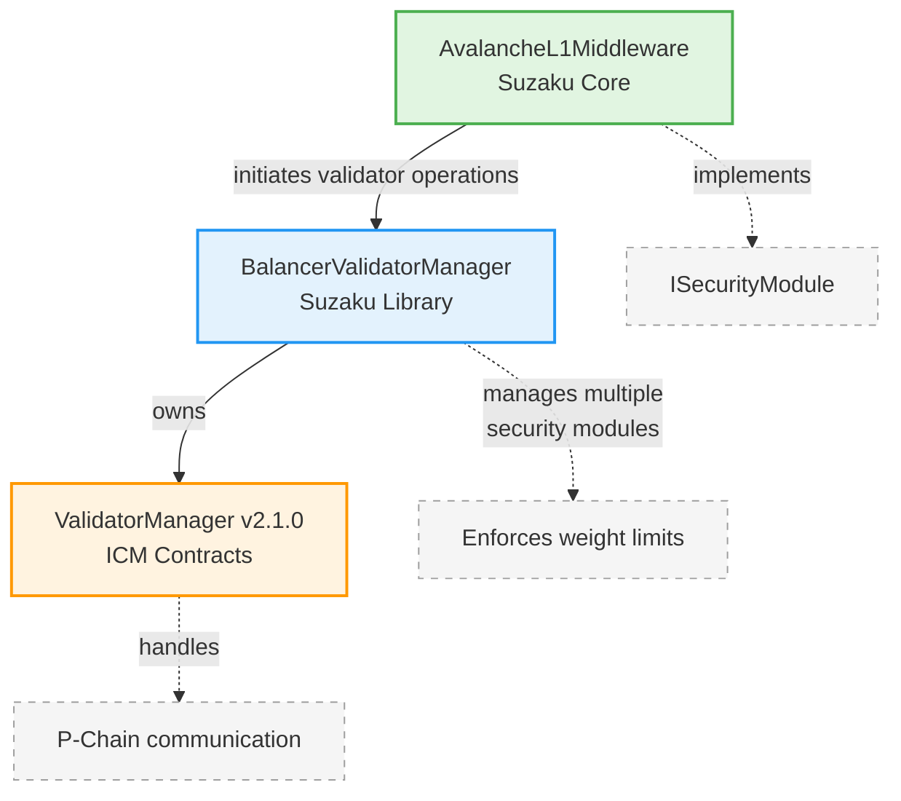

# Suzaku Core

Core smart contracts for the Suzaku Protocol - a restaking and validation orchestration platform for Avalanche L1s.

## Table of Contents

- [Overview](#overview)
- [Architecture](#architecture)
- [Development](#development)
  - [Prerequisites](#prerequisites)
  - [Installation](#installation)
  - [Testing](#testing)
  - [Deployment](#deployment)
- [Documentation](#documentation)
- [Security](#security)
- [Inspiration & Acknowledgments](#inspiration--acknowledgments)
- [License](#license)
- [Links](#links)

## Overview

Suzaku enables Avalanche L1 builders to decentralize their networks by orchestrating relationships between operators, curators (delegators), and stakers. The protocol combines native token staking with restaking of high‑quality collateral assets (e.g. stablecoins, liquid staking tokens), allowing L1s to adopt flexible security models.

**Suzaku Core is a fork of [Symbiotic Core](https://github.com/symbioticfi/core), adapted for Avalanche L1 validation.** While maintaining Symbiotic's delegation/vault patterns, Suzaku has been reworked to integrate Avalanche's ICM (Interchain Messaging) and validator management infrastructure, shifting from generic network security to L1‑centric validation orchestration.

For detailed protocol information, see the [Protocol Overview](./docs/overview.md).

## Architecture

The protocol consists of modular components that work together to enable flexible L1 security:



**Key Components:**
- **Vaults & Delegation**: ERC4626-style vaults with epoch-based withdrawals
- **Middleware**: Security module managing validators and stake allocation
- **Registries**: Track L1s, operators, and vaults
- **Rewards**: Epoch-based distribution with multi-collateral support

## Development

### Prerequisites
- [Foundry](https://book.getfoundry.sh/getting-started/installation)
- Solidity 0.8.25

### Installation
```bash
# Clone the repository
git clone https://github.com/suzaku-network/suzaku-core.git
cd suzaku-core

# Install dependencies
forge install

# Build contracts
forge build
```

### Testing
```bash
# Run all tests
forge test

# Run specific test file
forge test --match-path test/path/to/Test.t.sol

# Run with gas reports
forge test --gas-report

# Run with verbosity
forge test -vvv
```

### Deployment

Check **[Suzaku Deployer](https://github.com/suzaku/suzaku-deployer)** for information on how to deploy different Suzaku Core contracts depending on your use case.

## Documentation

- [Protocol Overview](./docs/overview.md): Detailed protocol explanation and component architecture
- [Vault Documentation](./docs/vault.md): Comprehensive vault mechanics and integration patterns
- [Middleware Documentation](./docs/middleware.md): Middleware-specific details and validator management
- [Rewards Documentation](./docs/rewards.md): Rewards system deep dive
- [BalancerValidatorManager](./lib/suzaku-contracts-library/src/contracts/ValidatorManager/README.md): Security module architecture
- [Post-Audit Updates](./post-audit-updates.md): Changes from audit baseline to current implementation

## Security

This codebase has undergone security audits:
- **Cyfrin Audit** (baseline commit `7381169`)
- Current implementation includes post-audit fixes and improvements

Audit reports can be found in the [audit/](./audit/) directory.

## Inspiration & Acknowledgments

**Suzaku Core is a fork of [Symbiotic Core](https://github.com/symbioticfi/core)**, adapted for the Avalanche ecosystem. The protocol inherits Symbiotic's vault architecture, delegation patterns, and operator registry concepts, while introducing significant modifications for Avalanche L1 validation.

Additional inspiration:
- [Eigenlayer](https://github.com/Layr-Labs/eigenlayer-contracts): Restaking concepts and security models

### Major Modifications from Symbiotic
- **L1-Specific**: Secures Avalanche `L1`s instead of generic `Network`s - each L1 must correspond to an existing Avalanche L1 converted via `ConvertSubnetTx`
- **Middleware Layer**: Introduces `AvalancheL1Middleware` as a security module implementing `ISecurityModule` for integration with `BalancerValidatorManager`
- **ICM Integration**: Deep integration with Avalanche's Interchain Messaging (ICM) and ValidatorManager v2.1.0 for P-Chain communication
- **Epoch-Based Rewards**: Custom rewards distribution system based on validator uptime tracking
- **Collateral Classes**: Multi-collateral support with decimal validation and weight-based distribution (notably modified in middleware and rewards)
- **No Common Contracts**: Doesn't use Symbiotic's `common` contracts standardization
- **Non-Migratable Vaults**: Vaults are upgradeable via proxy pattern but not migratable between implementations

## License

Dual-licensed under [MIT](./LICENSE-MIT) and [AGPL-3.0](./LICENSE).

## Links

- [Documentation](./docs/)
- [Suzaku Contracts Library](https://github.com/suzaku-network/suzaku-contracts-library)
- [Suzaku Deployer](https://github.com/suzaku/suzaku-deployer)
- [Avalanche ICM Contracts](https://github.com/ava-labs/icm-contracts)
