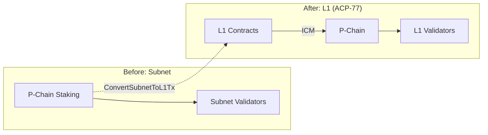
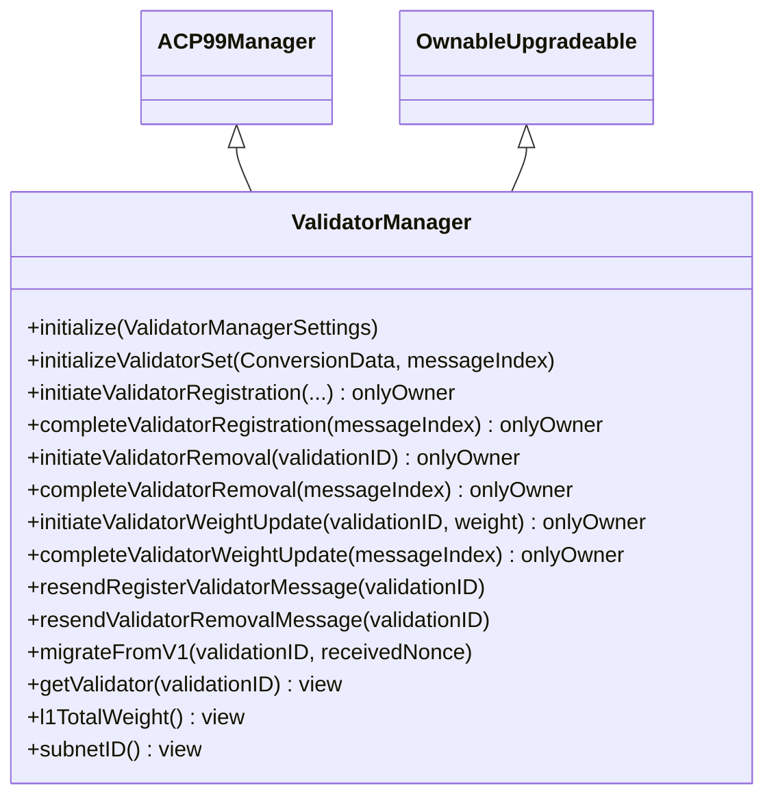
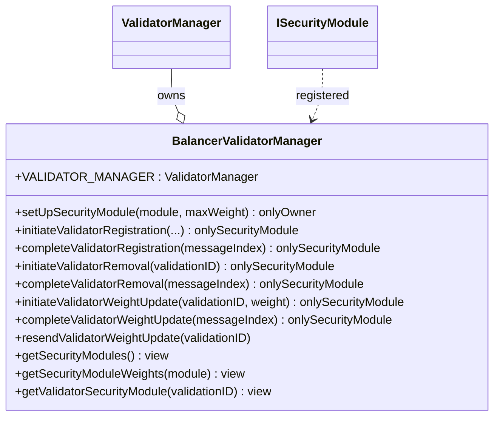
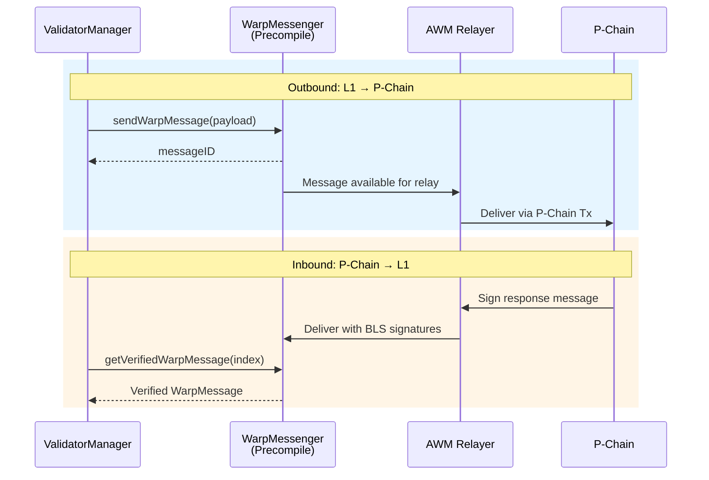
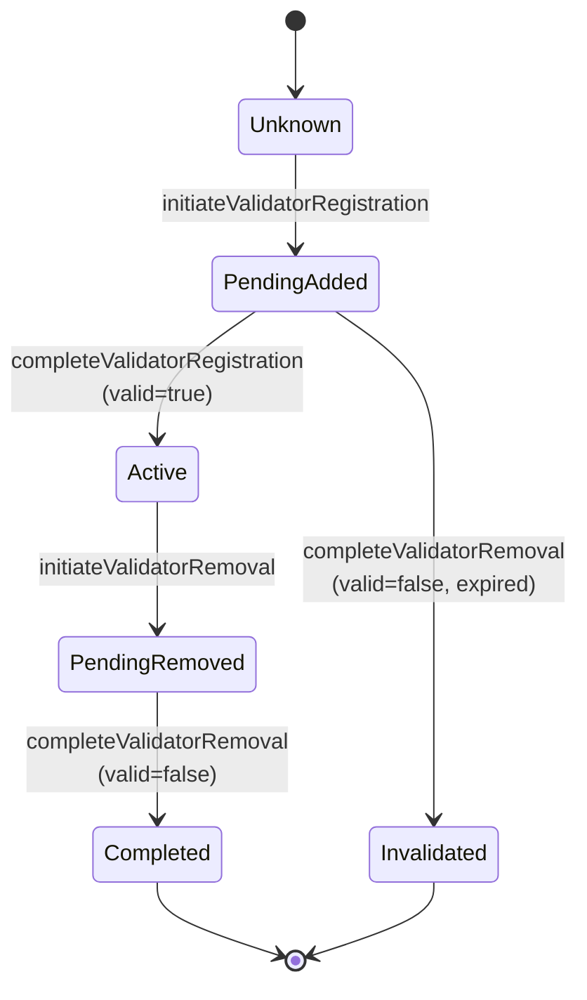
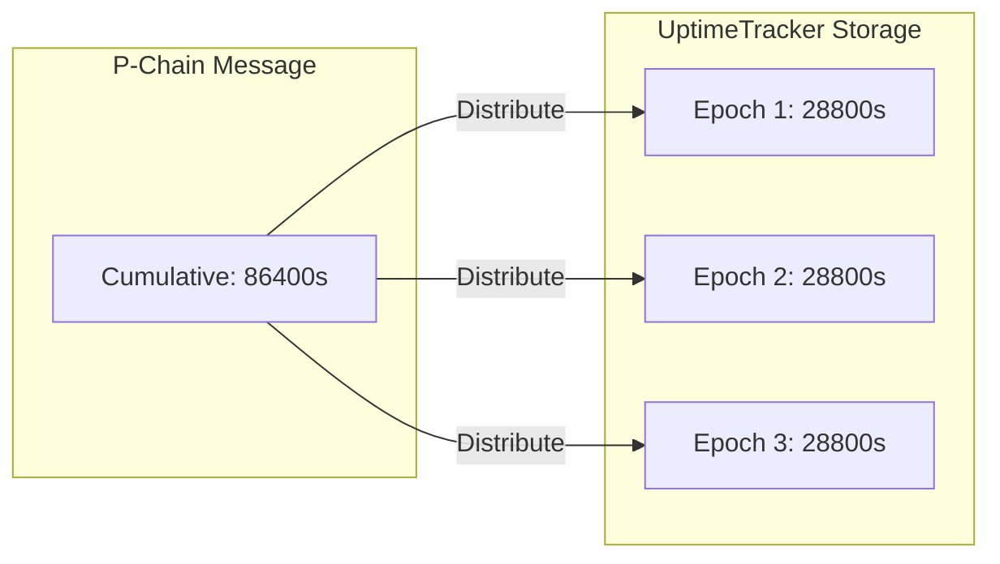
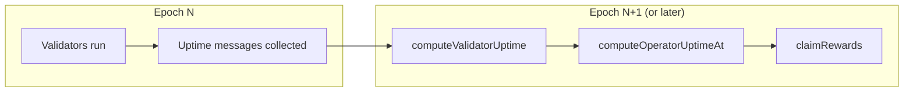

# ICM & P-Chain Integration

This document provides a comprehensive technical reference for Avalanche L1 validator management through smart contracts, covering the full stack from P-Chain communication to uptime tracking and rewards.

---

## Table of Contents

- [Introduction](#introduction)
- [Avalanche L1 Architecture](#avalanche-l1-architecture)
  - [Subnet-to-L1 Conversion](#subnet-to-l1-conversion)
  - [Sovereign Validation](#sovereign-validation)
- [Contract Stack](#contract-stack)
  - [ACP-99 Manager (Abstract)](#acp-99-manager-abstract)
  - [ValidatorManager (ICM)](#validatormanager-icm)
  - [BalancerValidatorManager (Suzaku Library)](#balancervalidatormanager-suzaku-library)
  - [Security Modules](#security-modules)
- [P-Chain Communication](#p-chain-communication)
  - [Warp Messaging Precompile](#warp-messaging-precompile)
  - [Message Flow](#message-flow)
  - [Message Types](#message-types)
  - [BLS Signature Aggregation](#bls-signature-aggregation)
- [Validator Lifecycle](#validator-lifecycle)
  - [Validator States](#validator-states)
  - [State Transitions](#state-transitions)
  - [Registration](#registration)
  - [Weight Updates](#weight-updates)
  - [Removal](#removal)
  - [Expiry and Invalidation](#expiry-and-invalidation)
- [Asynchronous Operations](#asynchronous-operations)
  - [Two-Phase Commit Pattern](#two-phase-commit-pattern)
  - [Nonce Management](#nonce-management)
  - [Message Resending](#message-resending)
  - [Handling Failures](#handling-failures)
- [Churn Rate Control](#churn-rate-control)
  - [Churn Period](#churn-period)
  - [Churn Calculation](#churn-calculation)
  - [Configuration Limits](#configuration-limits)
- [Uptime Tracking](#uptime-tracking)
  - [ValidationUptimeMessage](#validationuptimemessage)
  - [Cumulative vs Per-Epoch Uptime](#cumulative-vs-per-epoch-uptime)
  - [Uptime Distribution](#uptime-distribution)
  - [Operator Aggregation](#operator-aggregation)
- [Integration with Rewards](#integration-with-rewards)
  - [Uptime Requirements](#uptime-requirements)
  - [Epoch-Based Distribution](#epoch-based-distribution)
- [Data Structures](#data-structures)
  - [Validator Struct](#validator-struct)
  - [PChainOwner](#pchainowner)
  - [ConversionData](#conversiondata)
- [Security Considerations](#security-considerations)
- [Common Patterns](#common-patterns)
- [Troubleshooting](#troubleshooting)
- [References](#references)

---

## Introduction

Avalanche L1s (formerly "Subnets") are sovereign blockchain networks that can define their own validator sets. Unlike the primary network, L1 validators are managed through smart contracts deployed on the L1 itself, communicating with the P-Chain via **Interchain Messaging (ICM)**.

This document covers:
- How validator management contracts communicate with the P-Chain
- The complete validator lifecycle (registration → weight updates → removal)
- Uptime tracking and its integration with rewards
- Best practices for building security modules

---

## Avalanche L1 Architecture

### Subnet-to-L1 Conversion

Before ACP-77, Subnets required P-Chain staking. Post-conversion, L1s manage their own validators:



**Key transaction**: `ConvertSubnetToL1Tx` on P-Chain converts a Subnet to an L1, specifying:
- Initial validator set
- ValidatorManager contract address
- ValidatorManager blockchain ID

### Sovereign Validation

After conversion, the L1's `ValidatorManager` contract has full authority over its validator set:
- Add/remove validators
- Update validator weights
- Define staking/slashing rules
- Integrate with restaking protocols

The P-Chain trusts messages signed by the L1's current validator set (via BLS aggregation).

---

## Contract Stack

### ACP-99 Manager (Abstract)

Defined in [ACP-99](https://github.com/avalanche-foundation/ACPs/tree/main/ACPs/99-validatorsetmanager-contract), this abstract contract specifies the standard interface:

```solidity
abstract contract ACP99Manager is IACP99Manager {
    // Public functions (defined in IACP99Manager)
    function initializeValidatorSet(ConversionData, uint32 messageIndex) external;
    function completeValidatorRegistration(uint32 messageIndex) external returns (bytes32);
    function completeValidatorRemoval(uint32 messageIndex) external returns (bytes32);
    function completeValidatorWeightUpdate(uint32 messageIndex) external returns (bytes32, uint64);
    
    // Internal functions (for derived contracts)
    function _initiateValidatorRegistration(...) internal virtual returns (bytes32);
    function _initiateValidatorRemoval(bytes32 validationID) internal virtual;
    function _initiateValidatorWeightUpdate(bytes32 validationID, uint64 weight) internal virtual;
}
```

### ValidatorManager (ICM)

The core implementation from `icm-contracts`:



**Key settings:**
```solidity
struct ValidatorManagerSettings {
    address admin;              // Contract owner
    bytes32 subnetID;           // L1's subnet ID
    uint64 churnPeriodSeconds;  // Churn tracking window (max 1 day)
    uint8 maximumChurnPercentage; // Max churn per period (1-20%)
}
```

### BalancerValidatorManager (Suzaku Library)

Wraps `ValidatorManager` to enable multi-tenant validator management:



See [BalancerValidatorManager README](./README.md) for detailed documentation.

### Security Modules

Security modules implement `ISecurityModule` and manage subsets of validators:

| Module | Description |
|--------|-------------|
| `PoASecurityModule` | Owner-controlled validator management |
| `AvalancheL1Middleware` | Restaking-based validator management (Suzaku Core) |
| Custom modules | Any contract implementing `ISecurityModule` |

---

## P-Chain Communication

### Warp Messaging Precompile

All P-Chain communication uses the **WarpMessenger** precompile:

```solidity
IWarpMessenger constant WARP_MESSENGER = 
    IWarpMessenger(0x0200000000000000000000000000000000000005);
```

**Sending messages:**
```solidity
bytes memory payload = ValidatorMessages.packL1ValidatorWeightMessage(
    validationID, 
    nonce, 
    weight
);
bytes32 messageID = WARP_MESSENGER.sendWarpMessage(payload);
```

**Receiving messages:**
```solidity
(WarpMessage memory warpMessage, bool valid) = 
    WARP_MESSENGER.getVerifiedWarpMessage(messageIndex);

// Verification requirements for P-Chain messages:
require(valid, "Invalid warp message");
require(warpMessage.sourceChainID == bytes32(0), "Not from P-Chain");
require(warpMessage.originSenderAddress == address(0), "Not off-chain origin");
```

### Message Flow



### Message Types

Defined in `ValidatorMessages.sol`:

| Type ID | Message | Direction | Purpose |
|---------|---------|-----------|---------|
| 0 | `SubnetToL1ConversionMessage` | P→L1 | Initial validator set (one-time) |
| 1 | `RegisterL1ValidatorMessage` | L1→P | Request validator registration |
| 2 | `L1ValidatorRegistrationMessage` | P→L1 | Registration result |
| 3 | `L1ValidatorWeightMessage` | Both | Weight change request/ack |
| 0* | `ValidationUptimeMessage` | L1-signed | Validator uptime proof |

*`ValidationUptimeMessage` uses type ID 0 but is signed by L1 validators, not P-Chain.

**Message formats:**

```
RegisterL1ValidatorMessage (L1 → P-Chain):
+-----------------------+-------------+
|               codecID :      uint16 |   2 bytes
|                typeID :      uint32 |   4 bytes
|              subnetID :    [32]byte |  32 bytes
|                nodeID :      []byte |   4 + len bytes
|          blsPublicKey :    [48]byte |  48 bytes
|                expiry :      uint64 |   8 bytes
| remainingBalanceOwner : PChainOwner |   8 + addrs*20 bytes
|          disableOwner : PChainOwner |   8 + addrs*20 bytes
|                weight :      uint64 |   8 bytes
+-----------------------+-------------+

L1ValidatorWeightMessage (Bidirectional):
+--------------+----------+
|      codecID :   uint16 |   2 bytes
|       typeID :   uint32 |   4 bytes
| validationID : [32]byte |  32 bytes
|        nonce :   uint64 |   8 bytes
|       weight :   uint64 |   8 bytes
+--------------+----------+  54 bytes total

ValidationUptimeMessage (L1-signed):
+--------------+----------+
|      codecID :   uint16 |   2 bytes
|       typeID :   uint32 |   4 bytes
| validationID : [32]byte |  32 bytes
|       uptime :   uint64 |   8 bytes
+--------------+----------+  46 bytes total
```

### BLS Signature Aggregation

Warp messages are secured by BLS signature aggregation:

1. L1 validators sign the message
2. Signatures are aggregated into a single BLS signature
3. AWM relayer delivers message + aggregated signature
4. WarpMessenger verifies signatures against current validator set

**Minimum quorum**: Typically 67% of validator weight must sign.

---

## Validator Lifecycle

### Validator States

```solidity
enum ValidatorStatus {
    Unknown,        // Not registered
    PendingAdded,   // Registration initiated, awaiting P-Chain ack
    Active,         // Actively validating
    PendingRemoved, // Removal initiated, awaiting P-Chain ack
    Completed,      // Successfully removed
    Invalidated     // Registration expired without P-Chain ack
}
```

### State Transitions



### Registration

**1. Initiate** (`initiateValidatorRegistration`):
```solidity
bytes32 validationID = validatorManager.initiateValidatorRegistration(
    nodeID,           // 20 bytes - Avalanche node ID
    blsPublicKey,     // 48 bytes - BLS public key
    remainingBalanceOwner, // P-Chain owner for remaining stake
    disableOwner,     // P-Chain owner who can disable validator
    weight            // uint64 - validator weight
);
```

**Validations:**
- NodeID not already registered
- BLS key is 48 bytes
- Weight doesn't exceed churn limits
- Total weight wouldn't overflow uint64

**2. P-Chain processing:**
- `RegisterL1ValidatorTx` submitted to P-Chain
- P-Chain validates and adds to validator set
- P-Chain signs `L1ValidatorRegistrationMessage` (valid=true)

**3. Complete** (`completeValidatorRegistration`):
```solidity
bytes32 validationID = validatorManager.completeValidatorRegistration(messageIndex);
// Status: PendingAdded → Active
```

**Registration expiry**: If not completed within 1 day, registration can be cancelled.

### Weight Updates

**1. Initiate** (`initiateValidatorWeightUpdate`):
```solidity
(uint64 nonce, bytes32 messageID) = validatorManager.initiateValidatorWeightUpdate(
    validationID,
    newWeight
);
// Increments sentNonce
// Sends L1ValidatorWeightMessage to P-Chain
```

**2. Complete** (`completeValidatorWeightUpdate`):
```solidity
(bytes32 validationID, uint64 nonce) = validatorManager.completeValidatorWeightUpdate(
    messageIndex
);
// Updates receivedNonce
// Weight change is now acknowledged
```

### Removal

**1. Initiate** (`initiateValidatorRemoval`):
```solidity
validatorManager.initiateValidatorRemoval(validationID);
// Status: Active → PendingRemoved
// Sends L1ValidatorWeightMessage with weight=0
```

**2. Complete** (`completeValidatorRemoval`):
```solidity
bytes32 validationID = validatorManager.completeValidatorRemoval(messageIndex);
// Status: PendingRemoved → Completed
// Validator removed from registry
```

### Expiry and Invalidation

If a `RegisterL1ValidatorMessage` is not delivered to P-Chain before expiry:
- P-Chain will not register the validator
- P-Chain signs `L1ValidatorRegistrationMessage` (valid=false)
- `completeValidatorRemoval` sets status to `Invalidated`
- Weight is removed from churn tracking (but not counted as churn)

---

## Asynchronous Operations

### Two-Phase Commit Pattern

All validator operations are two-phase:

| Phase | Function | State Change | Notes |
|-------|----------|--------------|-------|
| Initiate | `initiate*` | Optimistic update | Weight/status changed immediately |
| Complete | `complete*` | Finalize | P-Chain acknowledgment required |

**Why two-phase?**
- P-Chain must validate changes
- Prevents conflicting validator sets
- Enables proper sequencing of operations

### Nonce Management

Each validator tracks message ordering:

```solidity
struct Validator {
    // ...
    uint64 sentNonce;     // Incremented on each weight change initiation
    uint64 receivedNonce; // Updated when P-Chain acknowledges
    // ...
}
```

**Pending detection:**
```solidity
bool hasPending = validator.sentNonce > validator.receivedNonce;
```

**Invariants:**
- `receivedNonce <= sentNonce` always
- P-Chain won't sign nonces > `sentNonce`
- Messages must be completed in order (nonce N must be received before N+1)

### Message Resending

If a message is not delivered (relayer issues, network congestion):

```solidity
// Resend registration message
validatorManager.resendRegisterValidatorMessage(validationID);

// Resend removal message (weight=0)
validatorManager.resendValidatorRemovalMessage(validationID);

// Resend weight update (BalancerValidatorManager only)
balancer.resendValidatorWeightUpdate(validationID);
```

These functions are **permissionless** — anyone can call them to maintain liveness.

### Handling Failures

**Scenario 1: Registration expires**
- Call `completeValidatorRemoval` with P-Chain's invalid=false message
- Status becomes `Invalidated`
- Weight freed without churn penalty

**Scenario 2: Weight update stuck**
- Call `resendValidatorWeightUpdate` (permissionless)
- Wait for P-Chain acknowledgment
- If still stuck, may need to wait for relayer

**Scenario 3: Removal stuck**
- Call `resendValidatorRemovalMessage` (permissionless)
- Validator remains in `PendingRemoved` until acknowledged

---

## Churn Rate Control

### Churn Period

Churn tracking prevents rapid validator set changes:

```solidity
struct ValidatorChurnPeriod {
    uint256 startTime;    // Period start timestamp
    uint64 initialWeight; // Total weight at period start
    uint64 totalWeight;   // Current total weight
    uint64 churnAmount;   // Weight added/removed this period
}
```

### Churn Calculation

```solidity
// On each weight change:
function _checkAndUpdateChurnTracker(uint64 newWeight, uint64 oldWeight) {
    uint64 weightChange = abs(newWeight - oldWeight);
    
    if (currentTime >= churnTracker.startTime + churnPeriodSeconds) {
        // New period
        churnTracker.churnAmount = weightChange;
        churnTracker.startTime = currentTime;
        churnTracker.initialWeight = churnTracker.totalWeight;
    } else {
        // Same period
        churnTracker.churnAmount += weightChange;
    }
    
    // Check limit
    require(
        maximumChurnPercentage * churnTracker.initialWeight >= churnTracker.churnAmount * 100,
        "MaxChurnRateExceeded"
    );
    
    churnTracker.totalWeight += newWeight - oldWeight;
}
```

### Configuration Limits

| Parameter | Min | Max | Notes |
|-----------|-----|-----|-------|
| `churnPeriodSeconds` | - | 86400 (1 day) | Must be ≤ registration expiry |
| `maximumChurnPercentage` | 1% | 20% | Applied to initial weight |

**Example:**
- `initialWeight = 10000`
- `maximumChurnPercentage = 10%`
- Max churn per period = 1000 weight

---

## Uptime Tracking

### ValidationUptimeMessage

Validators sign uptime proofs that attest to their cumulative online time:

```
ValidationUptimeMessage:
| validationID | 32 bytes |
|       uptime |  8 bytes | (cumulative seconds online)
```

**Verification:**
```solidity
(WarpMessage memory msg, bool valid) = WARP_MESSENGER.getVerifiedWarpMessage(index);
require(valid);
require(msg.sourceChainID == uptimeBlockchainID);  // L1's blockchain ID
require(msg.originSenderAddress == address(0));     // Off-chain origin

(bytes32 validationID, uint64 uptime) = 
    ValidatorMessages.unpackValidationUptimeMessage(msg.payload);
```

### Cumulative vs Per-Epoch Uptime

**P-Chain provides:** Cumulative uptime (total seconds online since validator start)

**Suzaku tracks:** Per-epoch uptime (seconds online during each epoch)



### Uptime Distribution

When an uptime message is processed:

1. **Calculate delta:** `newUptime - lastAttributedUptime`
2. **Add remaining:** Previous epoch's `remainingUptime`
3. **Cap at elapsed time:** `elapsedEpochs × epochDuration`
4. **Distribute evenly:** Split across elapsed epochs
5. **Carry excess:** Save as `remainingUptime` for next update

```solidity
// Example: 3 epochs elapsed, 30s each, 100s to distribute
uptimePerEpoch = 100 / 3 = 33s each (remainder to earliest)
// Epoch 1: 34s, Epoch 2: 33s, Epoch 3: 33s
```

### Operator Aggregation

Operators can have multiple validators. Uptime is averaged:

```solidity
function computeOperatorUptimeAt(address operator, uint48 epoch) {
    bytes32[] memory valIDs = middleware.getOperatorValidationIDs(operator);
    uint256 totalUptime = 0;
    uint256 activeCount = 0;
    
    for (uint i = 0; i < valIDs.length; i++) {
        if (isActiveInEpoch(valIDs[i], epoch)) {
            totalUptime += validatorUptimePerEpoch[epoch][valIDs[i]];
            activeCount++;
        }
    }
    
    operatorUptimePerEpoch[epoch][operator] = totalUptime / activeCount;
}
```

---

## Integration with Rewards

### Uptime Requirements

Operators must meet minimum uptime to receive rewards:

```solidity
// In RewardsNativeToken
if (uptimeTracker.operatorUptimePerEpoch(epoch, operator) < minRequiredUptime) {
    operatorShares = 0; // No rewards for this epoch
}
```

### Epoch-Based Distribution



**Timeline:**
1. Epoch N: Validators run, uptime accumulates
2. After epoch N ends: Submit uptime proofs via `computeValidatorUptime`
3. After all validators processed: Call `computeOperatorUptimeAt` for operator average
4. After operator uptime set: Operator can `claimRewards`

---

## Data Structures

### Validator Struct

```solidity
struct Validator {
    ValidatorStatus status;     // Current state
    bytes nodeID;               // 20-byte Avalanche node ID
    uint64 startingWeight;      // Weight at registration
    uint64 sentNonce;           // Last sent weight update nonce
    uint64 receivedNonce;       // Last acknowledged nonce
    uint64 weight;              // Current weight
    uint64 startTime;           // Activation timestamp
    uint64 endTime;             // Removal timestamp (0 if active)
}
```

### PChainOwner

Specifies P-Chain addresses that control validator funds or can disable:

```solidity
struct PChainOwner {
    uint32 threshold;       // Required signatures
    address[] addresses;    // P-Chain addresses (sorted, unique)
}
```

**Validation:**
- `threshold == 0` requires empty addresses
- `threshold <= addresses.length`
- Addresses must be sorted ascending
- No zero addresses

### ConversionData

Used for initial validator set initialization:

```solidity
struct ConversionData {
    bytes32 subnetID;
    bytes32 validatorManagerBlockchainID;
    address validatorManagerAddress;
    InitialValidator[] initialValidators;
}

struct InitialValidator {
    bytes nodeID;
    bytes blsPublicKey;
    uint64 weight;
}
```

---

## Security Considerations

1. **Warp message verification**: Always verify `sourceChainID`, `originSenderAddress`, and `valid` flag.

2. **Nonce ordering**: Complete weight updates in order; P-Chain enforces monotonic nonces.

3. **Churn rate limits**: Prevent rapid validator set takeover; cannot be bypassed.

4. **Registration expiry**: 1-day expiry prevents stale registrations blocking nodeIDs.

5. **Owner patterns**:
   - `ValidatorManager.onlyOwner` — restricts all operations
   - `BalancerValidatorManager.onlySecurityModule` — per-module isolation

6. **Permissionless resends**: Critical for liveness; cannot be weaponized (just resends existing messages).

7. **Uptime monotonicity**: UptimeTracker rejects uptime values ≤ previous maximum.

---

## Common Patterns

### Keeper Automation

```solidity
// Complete pending operations (permissionless)
function completePending(uint32 messageIndex) external {
    try balancer.completeValidatorRegistration(messageIndex) {}
    catch {}
    
    try balancer.completeValidatorRemoval(messageIndex) {}
    catch {}
    
    try balancer.completeValidatorWeightUpdate(messageIndex) {}
    catch {}
}
```

### Uptime Submission

```solidity
// Submit uptime for all operators at epoch end
function submitUptime(uint32[] calldata messageIndexes, address[] calldata operators, uint48 epoch) external {
    // Process validator uptimes
    for (uint i = 0; i < messageIndexes.length; i++) {
        uptimeTracker.computeValidatorUptime(messageIndexes[i]);
    }
    
    // Aggregate to operators
    for (uint i = 0; i < operators.length; i++) {
        uptimeTracker.computeOperatorUptimeAt(operators[i], epoch);
    }
}
```

### Weight Monitoring

```solidity
// Check if validator has stuck pending update
function needsResend(bytes32 validationID) external view returns (bool) {
    return balancer.isValidatorPendingWeightUpdate(validationID);
}
```

---

## Troubleshooting

| Issue | Cause | Solution |
|-------|-------|----------|
| Registration stuck in PendingAdded | Message not delivered | Call `resendRegisterValidatorMessage` |
| Removal stuck in PendingRemoved | Message not delivered | Call `resendValidatorRemovalMessage` |
| Weight update stuck | Message not delivered | Call `resendValidatorWeightUpdate` |
| MaxChurnRateExceeded | Too many changes in period | Wait for churn period to reset |
| InvalidValidatorStatus | Wrong operation for state | Check validator status first |
| InvalidNonce | Nonce mismatch | Complete pending updates first |
| InvalidWarpMessage | Signature verification failed | Check relayer configuration |

---

## References

### Suzaku Core Documentation

- [Protocol Overview](./1-overview.md) — Suzaku Core architecture and components
- [BalancerValidatorManager](./9-balancer-validator-manager.md) — Multi-tenant validator management
- [Middleware](./4-middleware.md) — AvalancheL1Middleware as a security module
- [Uptime Tracker](./6-uptimeTracker.md) — Validator uptime tracking and distribution
- [Rewards](./5-rewardsNativeToken.md) — Epoch-based rewards distribution

### External References

- [ACP-77: Reinventing Subnets](https://github.com/avalanche-foundation/ACPs/tree/main/ACPs/77-reinventing-subnets) — L1 specification
- [ACP-99: ValidatorSetManager Contract](https://github.com/avalanche-foundation/ACPs/tree/main/ACPs/99-validatorsetmanager-contract) — Contract interface specification
- [ICM Contracts](https://github.com/ava-labs/icm-contracts) — Avalanche's validator manager implementation

