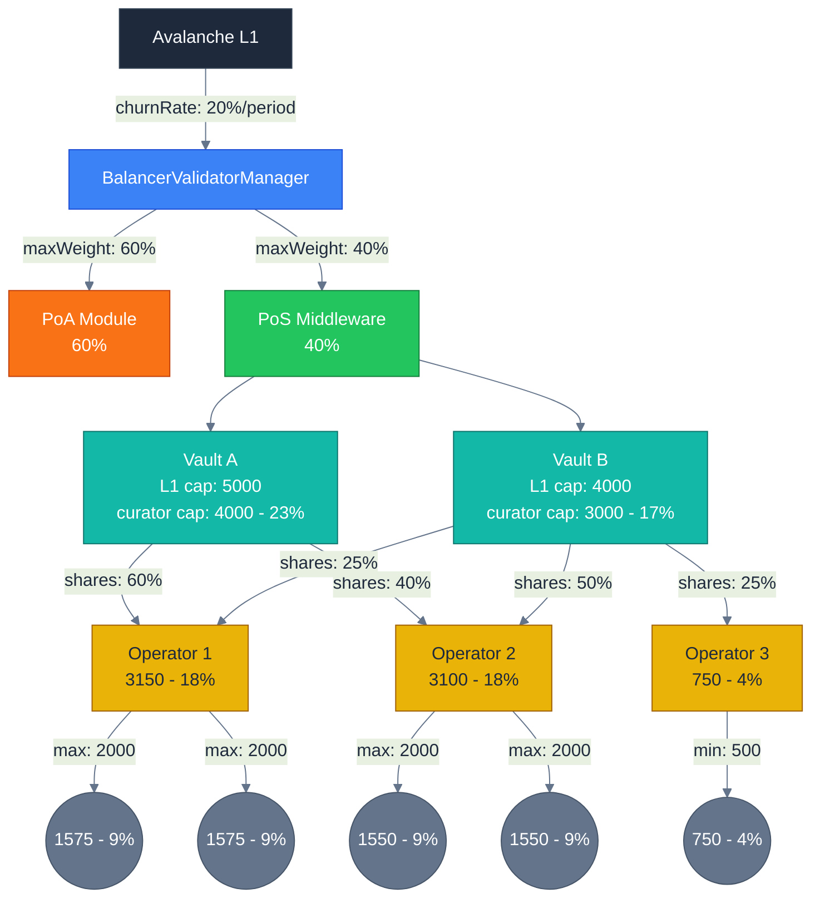

# Stake & Weight Limiting Factors

This document provides a comprehensive reference of all variables that limit stake/weight across different entities in the Suzaku protocol.

---

## Overview

Stake capacity flows top-down from the Avalanche L1 (unlimited) through increasingly constrained layers:




### Stake Capacity Subdivision (Single Path)

Following one path through the system to show how caps nest inside each other:

```
L1 TOTAL (100%)
├─────────────────────────────────────────────────────────────────────┐
│ PoS Module (40%)                                                    │
│ ├─────────────────────────────────────────────────────────────────┐ │
│ │ Vault A - L1 cap: 5000 (ceiling, not in calc)                   │ │
│ │ ├─────────────────────────────────────────────────────────────┐ │ │
│ │ │ curator cap: 4000 (23% of L1)                               │ │ │
│ │ │ ├─────────────────────────────────────────────────────────┐ │ │ │
│ │ │ │ Operator 1: 60% → 2400 (14% of L1)                      │ │ │ │
│ │ │ │ ├─────────────────────────────────────────────────────┐ │ │ │ │
│ │ │ │ │ Validator: min 500 (3%) / max 2000 (11%)            │ │ │ │ │
│ │ │ │ │ ├─────────────────────────────────────────────────┐ │ │ │ │ │
│ │ │ │ │ │ 1575 (9% of L1)                                 │ │ │ │ │ │
│ │ │ │ │ └─────────────────────────────────────────────────┘ │ │ │ │ │
│ │ │ │ └─────────────────────────────────────────────────────┘ │ │ │ │
│ │ │ └─────────────────────────────────────────────────────────┘ │ │ │
│ │ │ (unused: 1000)                                              │ │ │
│ │ └─────────────────────────────────────────────────────────────┘ │ │
│ └─────────────────────────────────────────────────────────────────┘ │
└─────────────────────────────────────────────────────────────────────┘
```

**Reading from outside in:**
1. L1 accepts 100% of available stake
2. PoS Module gets 40% allocation from Balancer
3. Vault A's L1 cap = 5000 (ceiling only - not used in stake calc)
4. Vault A's curator cap = 4000 → this IS used in calc → **23%** of L1
5. Operator 1 gets 60% of curator cap = 2400 → **14%** of L1
6. Validator limited by max: 2000 → gets 1575 → **9%** of L1

**% calculation:** All percentages are relative to total curator caps (7000) × PoS allocation (40%).

---

## Variable Reference

| Level | Variable | Constrains | Set By |
|-------|----------|------------|--------|
| Balancer | `maximumChurnPercentage` | Rate of weight changes | Balancer owner |
| Balancer | `securityModuleMaxWeight` | Max weight per module (%) | Balancer owner |
| Vault | `maxL1Limit` / "L1 cap" | Ceiling for vault stake | Middleware owner |
| Vault | `l1Limit` / "curator cap" | Actual stake limit (≤ L1 cap) | Curator |
| Vault | `depositLimit` | Max collateral in vault | Vault admin |
| Operator | `operatorL1Shares` | % share of curator cap | Curator |
| Validator | `minValidatorStake` | Min stake per validator | Middleware |
| Validator | `maxValidatorStake` | Max stake per validator | Middleware |
| Rewards | `minRequiredUptime` | Rewards eligibility | Rewards manager |

---

## Related Documentation

- [Vault Documentation](./3-vault.md) - Deposit limits and vault mechanics
- [Middleware Documentation](./4-middleware.md) - Operator and validator management
- [BalancerValidatorManager](../lib/suzaku-contracts-library/src/contracts/ValidatorManager/README.md) - Security module weight limits
- [Overview](./1-overview.md) - Protocol architecture 
