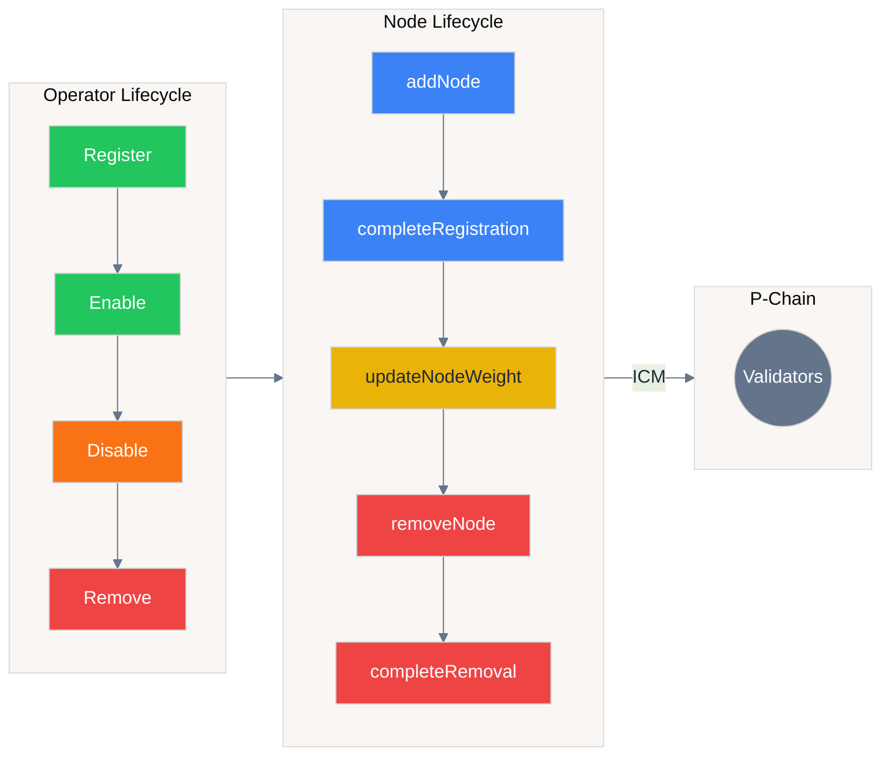
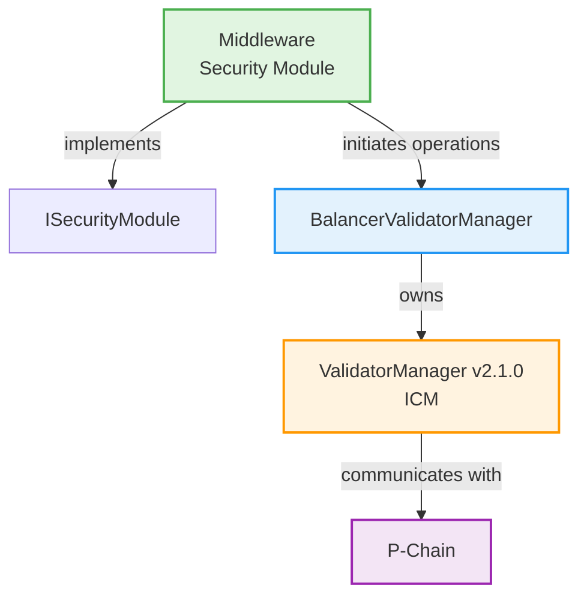
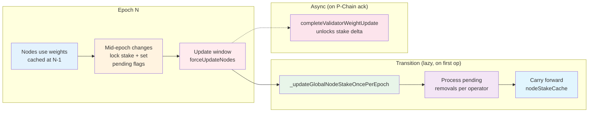
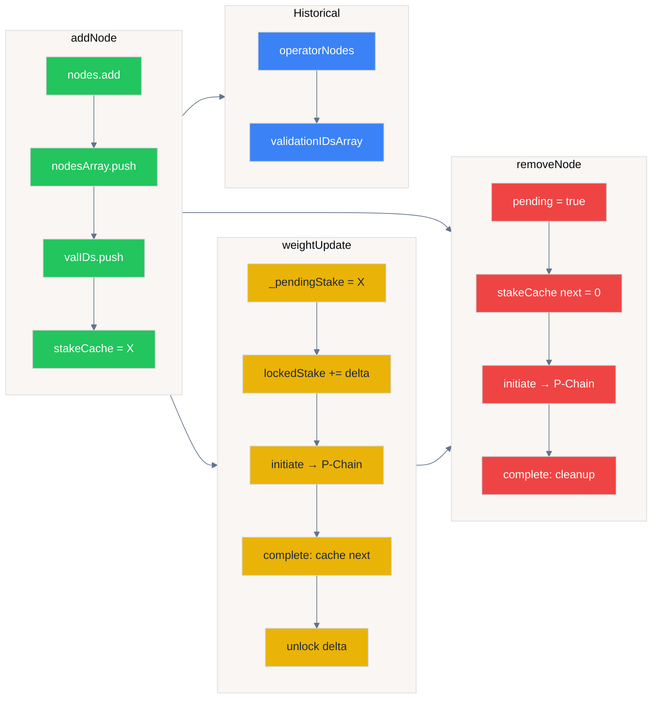

# Avalanche L1 Middleware

The middleware orchestrates validator management and stake tracking for Avalanche L1s, acting as a security module within the BalancerValidatorManager architecture.

---

## Index

- [Overview](#overview)
- [Architecture](#architecture)
  - [Security Module Integration](#security-module-integration)
  - [Collateral Classes](#collateral-classes)
- [Roles & Actors](#roles--actors)
- [Operator & Node Lifecycle](#operator--node-lifecycle)
  - [Registration Flow](#registration-flow)
  - [Node Operations](#node-operations)
- [Stake Management](#stake-management)
  - [Stake Calculation](#stake-calculation)
  - [Node Weight Calculation](#node-weight-calculation)
- [Epoch System](#epoch-system)
- [Time Windows](#time-windows)
- [Roles & Access Control](#roles--access-control)
- [Key Functions](#key-functions)
- [Storage Per Operator](#storage-per-operator)
- [Invariants](#invariants)
- [Integration Points](#integration-points)
- [Common Patterns](#common-patterns)
- [Error Handling](#error-handling)
- [Gas Optimizations](#gas-optimizations)
- [Security Considerations](#security-considerations)
- [Related Documentation](#related-documentation)

---

## Overview

**AvalancheL1Middleware** bridges restaking infrastructure with Avalanche's validator management system. It implements the `ISecurityModule` interface, managing operator lifecycle, node registration, and stake allocation across multiple collateral classes.



**Key responsibilities:**
- Operator and node lifecycle management
- Multi-collateral stake tracking and weight calculation
- Integration with BalancerValidatorManager for P-Chain communication
- Epoch-based state transitions and cache management

---

## Architecture

### Security Module Integration



The middleware initiates validator operations (registration, removal, weight updates) through the balancer, which enforces weight limits and coordinates with ICM's ValidatorManager for P-Chain messaging.

### Collateral Classes

**Primary Collateral Class (ID: 1):**
- Usually the L1's native token
- Required for all validators
- Has min and max stake requirements
- Uses `WEIGHT_SCALE_FACTOR` for stake-to-weight conversion

**Secondary Collateral Classes (ID: 2+):**
- Additional assets (stablecoins, LSTs, etc.)
- Optional, configured per L1
- Only have min stake requirement (no max)
- Active/inactive state per class

**CollateralClassRegistry** manages:
- Asset grouping by class
- Stake requirements (min/max)
- Asset decimal validation (all assets in a class must have matching decimals)

---

## Roles & Actors

### Protocol Admin Roles

**DEFAULT_ADMIN_ROLE**
- **Actor**: Protocol owner/DAO
- **Responsibilities**: Grant/revoke roles, critical system administration
- **Key Actions**: Role management, system upgrades

**OPERATORS_MANAGER_ROLE**  
- **Actor**: Protocol admin or delegated manager
- **Responsibilities**: Manage operator lifecycle
- **Key Actions**: `registerOperator`, `enableOperator`, `disableOperator`, `removeOperator`

**COLLATERAL_CLASS_MANAGER_ROLE**
- **Actor**: Protocol admin or treasury manager
- **Responsibilities**: Configure collateral classes and assets
- **Key Actions**: Add/remove collateral classes, activate/deactivate secondary classes, manage assets

**VAULTS_MANAGER_ROLE** (MiddlewareVaultManager)
- **Actor**: Protocol admin or vault manager
- **Responsibilities**: Register vaults and set limits
- **Key Actions**: `registerVault`, `updateVaultMaxL1Limit`, `removeVault`

### Operator Roles

**Validator Operators**
- **Actor**: Entities running validators
- **Responsibilities**: Node management, stake maintenance
- **Requirements**: Must opt-in to L1 and balancer
- **Key Actions**: `addNode`, `removeNode`, `initializeValidatorStakeUpdate`

### Permissionless Actors

**Anyone (Public)**
- **Actor**: Any EVM address
- **Responsibilities**: Maintain system health and complete pending operations
- **Key Actions**:
  - `forceUpdateNodes(operator, limitStake)` - Force node weight updates for any operator during update window
  - `completeValidatorRegistration(messageIndex)` - Complete pending node registrations
  - `completeValidatorRemoval(messageIndex)` - Complete pending node removals  
  - `completeValidatorWeightUpdate(messageIndex)` - Complete pending weight updates
  - `calcAndCacheStakes(epoch, collateralClass)` - Calculate and cache total stakes for rewards
  - `calcAndCacheNodeStakeForAllOperators()` - Update node stake cache for current epoch
  - `manualProcessNodeStakeCache(numEpochsToProcess)` - Process pending epoch updates when automatic fails

**Benefits of Permissionless Functions**:
- **System Liveness**: Prevents any single actor from blocking critical operations
- **Keeper Integration**: Allows automated bots to maintain system health
- **Gas Management**: Community can help process expensive operations
- **Forced Rebalancing**: Ensures validators maintain proper weights even if operators are inactive

---

## Operator & Node Lifecycle

### Registration Flow

1. **Operator Registration**
   - Register in `OperatorRegistry`
   - Opt-in to L1 via `OperatorL1OptInService`
   - Opt-in to balancer via `OperatorVaultOptInService`
   - Middleware registers operator: `registerOperator(operator)`

2. **Node Addition**
   - Call `addNode(nodeId, weight)` by operator
   - Validates operator has sufficient free stake
   - Locks stake to prevent over-allocation
   - Initiates registration via balancer → ValidatorManager → P-Chain
   - Node enters "pending registration" state

3. **Registration Completion**
   - Anyone can call `completeValidatorRegistration(messageIndex)` (permissionless)
   - P-Chain acknowledgment required
   - Node becomes active
   - Returns `validationID`

### Node Operations

**Weight Updates:**
- Anyone can call `forceUpdateNodes(operator, limitStake)` during update window
- Recalculates weight based on current stake
- Locks/unlocks stake delta
- Initiates weight update via balancer
- Completion via `completeValidatorWeightUpdate(messageIndex)` (permissionless)
- Nodes in `PendingWeightUpdate` state are skipped; complete pending updates first if needed

**Node Removal:**
- Operator calls `removeNode(nodeId)`
- Initiates removal via balancer
- Completion via `completeValidatorRemoval(messageIndex)` (permissionless)
- Unlocks operator's stake

---

## Stake Management

### Version Notes

Core v1.1 counts completed validator weight changes immediately for live
availability and rebalancing checks, while preserving epoch snapshots for
historical/reward accounting.

On unfixed Core v1.0 middleware deployments, after completing a validator weight
increase, operators should not initiate another weight-increasing operation in
the same middleware epoch, including another validator increase or adding a
node. During that window, available-stake accounting can overstate free backing
and allow validator weight to exceed the operator's delegated stake.

This is primarily an operational concern for multi-operator deployments, where
overstated weight can dilute other operators or weaken the stake-to-weight
assumption. For managed single-operator deployments, the module weight cap still
bounds total validator weight, but operators should still avoid the same-epoch
sequence above until upgraded.

### Stake Calculation

For each operator across all collateral classes:

```
operatorTotalStake = min(
    Σ(vaultDelegations for collateral class), 
    securityModuleMaxWeight * WEIGHT_SCALE_FACTOR
)
operatorUsedStake = Σ(effective node stakes for current commitments)
operatorLockedStake = stake locked in pending node updates
operatorFreeStake = operatorTotalStake - operatorUsedStake - operatorLockedStake
```

**Stake Cache:**
- `operatorStakeCache[epoch][operator][collateralClass]` stores historical stake
- Updated during epoch transitions via `_calcAndCacheNodeStakeForOperatorAtEpoch`
- Used by rewards system for distribution
- For live availability and rebalancing checks, current commitments use the post-completion
  next-epoch node stake when it exists; otherwise they use the current-epoch stake.
  This keeps completed same-epoch weight updates from being counted as free stake again
  while preserving the current-epoch snapshot for historical/reward accounting.

**Weight Scale Factor:**
- Converts stake amount to validator weight (uint64)
- Must satisfy: `ceil(maxStake / 2^64-1) ≤ factor ≤ minStake`
- Balances precision vs overflow protection

### Node Weight Calculation

```
nodeWeight = min(
    operatorStake / WEIGHT_SCALE_FACTOR,
    maxWeight (from BalancerValidatorManager security module limit)
)
```

Ensures:
- Weight fits in uint64
- Respects security module weight allocation
- Reflects actual available stake

---

## Epoch System

**Epochs provide:**
- Time boundaries for state transitions
- Historical stake snapshots
- Coordination with rewards distribution

**Epoch Flow:**



**Key mechanics:**
- **Lazy transition**: `_updateGlobalNodeStakeOncePerEpoch()` runs on first operation in new epoch
- **Carry forward**: `nodeStakeCache[epoch][valID] = nodeStakeCache[prevEpoch][valID]` for active nodes
- **Stake unlock**: Happens in `completeValidatorWeightUpdate` when P-Chain acknowledges, not at epoch boundary
- **Manual fallback**: If too many epochs pending, use `manualProcessNodeStakeCache(numEpochs)`

**Node Stake Cache Updates:**
- Automatic during first operation in new epoch (if gas permits)
- Manual via `manualProcessNodeStakeCache(operators, epoch)` if automatic update would exceed gas limits
- Tracks last processed epoch: `lastGlobalNodeStakeUpdateEpoch`

---

## Time Windows

**Grace Period (`SLASHING_WINDOW`):**
- Duration: e.g., 7 days
- Operator must wait this period after `disableOperator` before `removeOperator` can be called
- Also limits stake recalculation to epochs within this window
- **Note:** No actual slashing is implemented — only rewards can be lost for poor uptime

**Update Window:**
- Duration: `UPDATE_WINDOW` (final portion of epoch)
- When anyone can call `forceUpdateNodes` for any operator
- Ensures nodes start next epoch with correct weights

**Epoch Duration:**
- Fixed period: `EPOCH_DURATION` (e.g., 24 hours)
- All epochs have same length
- Synchronized with rewards system

---

## Roles & Access Control

**DEFAULT_ADMIN_ROLE:**
- Grant/revoke other roles
- Critical admin functions

**OPERATORS_MANAGER_ROLE:**
- `registerOperator`, `enableOperator`, `disableOperator`, `removeOperator`
- Manage operator lifecycle

**COLLATERAL_CLASS_MANAGER_ROLE:**
- `addCollateralClass`, `removeCollateralClass`
- `activateSecondaryCollateralClass`, `deactivateSecondaryCollateralClass`
- `addAssetToClass`, `removeAssetFromClass`
- Manage collateral configuration

**VAULTS_MANAGER_ROLE:** (in MiddlewareVaultManager)
- `registerVault`, `updateVaultMaxL1Limit`, `removeVault`
- Manage vault registration and limits

---

## Key Functions

### Operator Management
- `registerOperator(operator)` - Register operator to middleware
- `enableOperator(operator)` - Enable disabled operator
- `disableOperator(operator)` - Temporarily disable operator
- `removeOperator(operator)` - Permanently remove operator

### Node Operations (Operator-callable)
- `addNode(nodeId, blsKey, remainingBalanceOwner, disableOwner, stakeAmount)` - Register new validator node. Validates canonical nodeId format (high 96 bits must be zero).
- `removeNode(nodeId)` - Remove validator node  
- `initializeValidatorStakeUpdate(nodeId, stakeAmount)` - Manually update a specific node's weight

### Completion Functions (Permissionless)
- `completeValidatorRegistration(messageIndex)` - Complete node registration
- `completeValidatorRemoval(messageIndex)` - Complete node removal. Also handles cleanup for expired/invalidated registrations.
- `completeValidatorWeightUpdate(messageIndex)` - Complete weight update

### Query Functions
- `getOperatorValidationIDs(operator)` - Returns all validationIDs ever registered by an operator (append-only, for historical uptime tracking)

### Collateral Management
- `addCollateralClass(classId, minStake, maxStake, asset)` - Create new collateral class
- `activateSecondaryCollateralClass(classId)` - Activate secondary class for use
- `deactivateSecondaryCollateralClass(classId)` - Deactivate secondary class
- `addAssetToClass(classId, asset)` - Add asset to collateral class
- `removeAssetFromClass(classId, asset)` - Remove asset from collateral class

### State Management
- `manualProcessNodeStakeCache(operators, epoch)` - Manually update node stake cache
- `calcAndCacheStakes(epoch, collateralClass)` - Cache total stake for epoch

---

## Storage Per Operator

### Node State Tracking



**State transitions:**

| Operation | State Changes |
|-----------|---------------|
| `addNode` | `operatorNodes.add`, `operatorNodesArray.push`, `validationIDsArray.push`, `nodeStakeCache[epoch] = stake` |
| `initiateWeightUpdate` | `_pendingStake = newStake`, `operatorLockedStake += delta` |
| `completeWeightUpdate` | `nodeStakeCache[epoch+1] = newStake`, unlock delta from `operatorLockedStake` |
| `removeNode` | `nodePendingRemoval = true`, `nodeStakeCache[epoch+1] = 0` |
| `completeRemoval` | `_removeNodeFromArray()`, `nodePendingRemoval = false`, cleanup |

**Two-tier node tracking:**
- **`operatorNodes`** (Set) — permanent record, never removes nodes. Used for `getActiveNodesForEpoch()` historical queries
- **`operatorNodesArray`** (Array) — mutable, cleaned up on epoch transitions. Used for iteration during rebalancing

**Historical data (append-only):**
- **`operatorValidationIDsArray`** — all validationIDs ever registered. Used by UptimeTracker and primary-class reward distribution to find validators active during past epochs. **Never pruned** — it grows by one entry per validator registration, so a long-lived, high-rotation operator accumulates a large history that is re-iterated (one `getValidator` call per entry) on every uptime and distribution pass. Governance should monitor per-operator length via `getOperatorValidationIDs(operator)` and bound cumulative registrations; see [docs/5-rewardsNativeToken.md → Known Limitations](5-rewardsNativeToken.md#known-limitations).

**Per operator:**
- `operators[operator]` - Registration status, enabled/disabled
- `operatorNodes[operator]` - EnumerableSet of nodeIds (permanent record)
- `operatorNodesArray[operator]` - Array of nodeIds for iteration (cleaned up on epoch transitions)
- `operatorValidationIDsArray[operator]` - Append-only array of all validationIDs ever registered (for historical uptime)
- `operatorStakeCache[epoch][operator][collateralClass]` - Historical stake snapshots

**Per node:**
- `validationIdToOperator[validationId]` - Operator owner (private)
- `pendingRemovalValId[nodeId]` - ValidationID pending removal for this nodeId
- `nodePendingUpdate[validationId]` - Weight update pending flag
- `nodePendingRemoval[validationId]` - Removal pending flag
- `nodeStakeCache[epoch][validationId]` - Stake per epoch (carried forward or set to 0)

**Global:**
- `lastGlobalNodeStakeUpdateEpoch` - Last epoch with cache updates
- `collateralClasses` - Collateral class configurations
- `secondaryCollateralClasses` - Active secondary class IDs

---

## Invariants

- **Stake Lock**: `Σ(nodeWeights * WEIGHT_SCALE_FACTOR) + lockedStake ≤ operatorUsedStake`
- **Weight Bounds**: `nodeWeight ≤ maxWeight` (from security module allocation)
- **Collateral Decimals**: All assets in a class have identical decimals
- **Epoch Monotonicity**: Epochs only increase, never decrease
- **Node Uniqueness**: Each nodeId maps to exactly one operator
- **Pending State**: Node cannot be both pending update and pending removal

---

## Integration Points

**Upstream (Uses):**
- `IBalancerValidatorManager` - Validator operations and weight limits
- `IOperatorRegistry` - Operator registration verification
- `IOperatorL1OptInService` - L1 opt-in verification
- `IOperatorVaultOptInService` - Balancer opt-in verification

**Downstream (Used by):**
- `MiddlewareVaultManager` - Vault registration and limits
- `RewardsNativeToken` - Stake cache for reward distribution
- `UptimeTracker` - Node validation ID lookups

---

## Common Patterns

### Adding a Validator Node

1. Ensure operator has sufficient free stake
2. Call `addNode(nodeId, desiredWeight)`
3. Wait for P-Chain processing
4. Anyone calls `completeValidatorRegistration(messageIndex)`
5. Node is active with calculated weight

### Updating Stake Mid-Epoch

1. Vault deposits/withdrawals change operator's delegated stake
2. Stake is NOT immediately reflected in node weights
3. During update window: operator (or anyone) calls `forceUpdateNodes(operator, limitStake)`
4. Wait for P-Chain processing
5. Anyone calls `completeValidatorWeightUpdate(messageIndex)`
6. The completed weight is available to live availability/rebalancing checks immediately;
   the historical current-epoch cache remains unchanged and the next epoch begins with
   the new cached weight

**Note:** `forceUpdateNodes` skips nodes in `PendingWeightUpdate` state. If enforcement is needed and nodes are pending, first complete pending updates via `completeValidatorWeightUpdate`, then call `forceUpdateNodes`.

### Adding a Secondary Collateral Class

1. Call `addCollateralClass(classId, minStake, 0, initialAsset)`
2. Optionally `addAssetToClass(classId, otherAssets)` for multiple assets
3. Call `activateSecondaryCollateralClass(classId)`
4. Register vaults with this collateral class via `MiddlewareVaultManager`
5. Set reward share via `RewardsNativeToken.setRewardsBipsForCollateralClass(classId, basisPoints)`

---

## Error Handling

**Common errors:**
- `AvalancheL1Middleware__OperatorNotRegistered` - Operator not registered in middleware
- `AvalancheL1Middleware__OperatorNotOptedIn` - Operator hasn't opted into L1 or balancer
- `AvalancheL1Middleware__InsufficientStake` - Not enough free stake for operation
- `AvalancheL1Middleware__InvalidWindow` - Operation outside allowed time window
- `AvalancheL1Middleware__NodePending` - Node has pending operation (includes pending removal, weight update, or re-add attempt with pending removal)
- `AvalancheL1Middleware__NodeNotFound` - Node doesn't exist or not owned by operator
- `AvalancheL1Middleware__InvalidNodeIdFormat` - NodeId has non-zero high 96 bits (not canonical format)
- `CollateralClassRegistry__AssetDecimalsMismatch` - Asset decimals don't match class

**Known edge case:**
- Calling `removeOperator` on an operator that was never disabled will cause an underflow panic in `getEpochAtTs(0)`. Always call `disableOperator` first, then wait for the grace period before calling `removeOperator`.

---

## Gas Optimizations

- Modifiers converted to internal functions (reduces bytecode size)
- `unchecked` blocks in loops where overflow impossible
- Node stake cache updates batched, with manual processing for large operator sets
- Stake queries use cached values when available

---

## Security Considerations

**Stake Locking:**
- Prevents over-allocation by locking stake during pending operations
- In Core v1.1, completed weight increases are also counted immediately by live
  availability checks so the same backing cannot be reused in the completion
  epoch

**Permissionless Completion:**
- Anyone can complete validator operations after P-Chain acknowledgment
- Improves liveness, prevents operators from blocking state transitions
- Completion functions verify P-Chain response before state changes

**Decimal Validation:**
- Enforces identical decimals across collateral class assets
- Prevents calculation errors in stake aggregation

**Operator Opt-Ins:**
- Double opt-in required (L1 + balancer)
- Operators explicitly consent to validation duties
- Can opt-out to stop accepting new delegations

---

## Related Documentation

- [BalancerValidatorManager](../lib/suzaku-contracts-library/src/contracts/ValidatorManager/README.md) - Security module architecture
- [RewardsNativeToken](./5-rewardsNativeToken.md) - Stake cache usage in reward distribution
- [Protocol Overview](./1-overview.md) - Full protocol architecture
- [Post-Audit Updates](../post-audit-updates.md) - Recent changes and migrations
