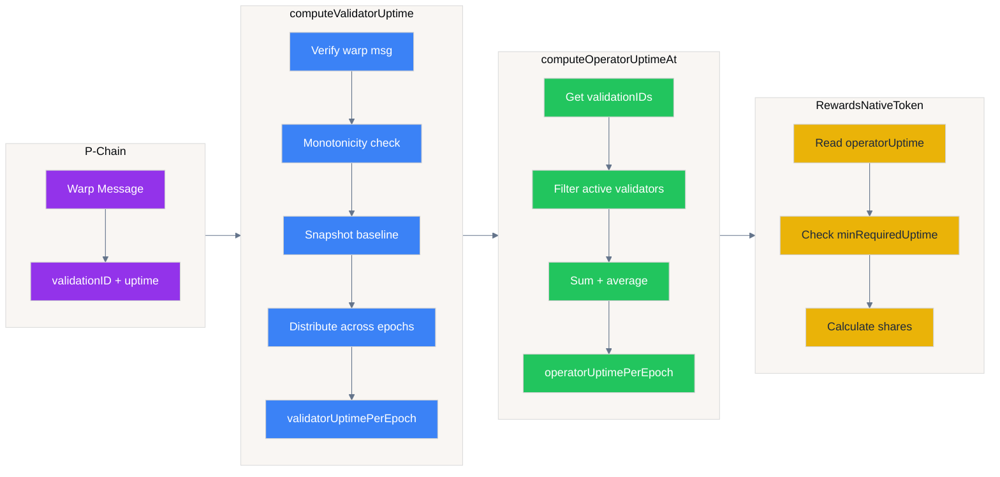

# UptimeTracker

Tracks validator uptime from P-Chain warp messages and aggregates it per operator per epoch for reward distribution.

---

## Overview

The UptimeTracker receives cumulative uptime proofs via Avalanche Warp Messaging and distributes them across epochs. It serves as the uptime source for `RewardsNativeToken`.



**Flow summary:**
1. **P-Chain** → Warp message with `(validationID, cumulative uptime)`
2. **computeValidatorUptime** → Distribute uptime across elapsed epochs per validator
3. **computeOperatorUptimeAt** → Aggregate validator uptimes into operator average
4. **RewardsNativeToken** → Read operator uptime, check threshold, calculate reward shares

**Message format** (`ValidationUptimeMessage`):
```
| validationID : [32]byte | 32 bytes |
|       uptime :   uint64 |  8 bytes |
```

---

## Constructor

```solidity
constructor(address payable middleware_, bytes32 uptimeBlockchainID_)
```

| Parameter | Description |
|-----------|-------------|
| `middleware_` | AvalancheL1Middleware contract address |
| `uptimeBlockchainID_` | L1's blockchain ID (must match warp message sourceChainID) |

**Derived immutables:**
- `epochDuration` from middleware
- `validatorManager` from middleware's BALANCER

---

## Functions

### `computeValidatorUptime(uint32 messageIndex)`

Reads a `ValidationUptimeMessage` from the Warp precompile and distributes uptime across elapsed epochs.

**Flow:**
1. Verify warp message (valid, correct sourceChainID, originSenderAddress == 0)
2. Unpack `(validationID, uptime)` from payload
3. Apply monotonicity guard: reject if `uptime <= validatorHighestUptime[validationID]`
4. Snapshot baseline checkpoint for current epoch (first call only)
5. Calculate `elapsedEpochs` and distribute uptime evenly across them
6. Update checkpoint for next epoch

**Same-epoch reprocessing:**
- Multiple calls within the same epoch are allowed
- Later calls with higher uptime overwrite earlier distributions
- Uses epoch baseline to ensure consistent `elapsedEpochs` calculation

### `computeOperatorUptimeAt(address operator, uint48 epoch)`

Aggregates validator uptimes into operator uptime for a given epoch.

**Flow:**
1. Get all `validationIDs` for operator from middleware
2. Filter validators active during the epoch (by start/end times)
3. Sum their `validatorUptimePerEpoch` values
4. Store the **unweighted arithmetic mean** (`sum / validatorCount`) as `operatorUptimePerEpoch`

> ⚠️ The aggregate is an **unweighted** mean — it does **not** weight each validator's uptime by its stake. This is exploitable by stake-concentrated operators; see [Known Limitations](#known-limitations).

**Reprocessing rules:**
- Same epoch: can reprocess, updates if computed value is higher
- Different epoch: reverts with `UptimeTracker__OperatorUptimeAlreadySet`

### `getLastUptimeCheckpoint(bytes32 validationID)`

Returns the last recorded checkpoint for a validator.

---

## Storage

| Mapping | Description |
|---------|-------------|
| `validatorLastUptimeCheckpoint` | Checkpoint state per validator (remainingUptime, attributedUptime, timestamp) |
| `validatorUptimePerEpoch` | Distributed uptime per (epoch, validationID) in seconds |
| `isValidatorUptimeSet` | Whether validator uptime is set for (epoch, validationID) |
| `operatorUptimePerEpoch` | Aggregated operator uptime per (epoch, operator) in seconds |
| `isOperatorUptimeSet` | Whether operator uptime is set for (epoch, operator) |
| `validatorHighestUptime` | Monotonicity guard: highest uptime seen per validationID |
| `validatorEpochBaseline` | Snapshot of checkpoint at first call in current epoch |
| `operatorUptimeComputedAtEpochPlusOne` | Epoch sentinel for same-epoch reprocessing |

---

## Checkpoint Model

Each validator has a `LastUptimeCheckpoint`:
```solidity
struct LastUptimeCheckpoint {
    uint256 remainingUptime;    // Excess uptime carried to next epoch
    uint256 attributedUptime;   // Last processed cumulative uptime value
    uint256 timestamp;          // Checkpoint timestamp (epoch start)
}
```

**Terms:**

| Term | Meaning |
|------|---------|
| `cumulativeUptime` | Total seconds validator was online since it started (from P-Chain warp message) |
| `attributedUptime` | Last cumulative value we processed (stored in checkpoint) |
| `remainingUptime` | Excess seconds carried over when uptime > elapsed time |
| `elapsedEpochs` | Number of epochs between last checkpoint and current epoch |
| `elapsedTime` | `elapsedEpochs × epochDuration` in seconds |
| `epoch baseline` | Snapshot of checkpoint, frozen on first call of the current epoch. Seals all previous epochs. Same-epoch recalculations reuse this frozen baseline |

**How uptime distribution works:**

*Running example: Last checkpoint was epoch 7 with `attributedUptime = 60s`, `remainingUptime = 10s`. Now in epoch 10. Epoch duration = 30s.*

1. **Receive warp message** from P-Chain containing `(validationID, cumulativeUptime)`
   - Example (1st message): `cumulativeUptime = 110s`

2. **Reject stale messages**: If `cumulativeUptime ≤ validatorHighestUptime[validationID]`, ignore it
   - Example: 110s > 60s (last highest), so message is valid, continue

3. **Calculate seconds to distribute** (using epoch baseline):
   - `remainingUptime` + (`cumulativeUptime` - `attributedUptime`)
   - = excess from previous epoch + (total uptime - already distributed)
   - Example: `10 + (110 - 60) = 60s` to distribute (note: uses the 10s remainingUptime from previous epoch)

4. **Cap at elapsed time**: 
   - Can't distribute more than `elapsedEpochs × epochDuration` (elapsed time)
   - If there's excess uptime, it is saved as `remainingUptime` for next epochs
   - Example: 3 epochs × 30s = 90s max. 60s < 90s, so distribute all 60s, `remainingUptime = 0`

5. **Split and write to per-epoch storage**:
   - Divide evenly across elapsed epochs, remainder goes to earliest epochs
   - Save the distributed uptime to each epoch from baseline epoch to current epoch - 1 (i.e., epochs 7, 8, 9 when in epoch 10 with baseline from epoch 7)
   - Only increase values, never decrease
   - **Window of opportunity**: All epochs since baseline remain updatable until the current epoch ends. Multiple warp messages during epoch 10 can improve values for epochs 7, 8, and 9.
   - **Sealing**: When epoch 11 begins, a new baseline is taken. Epochs 7, 8, 9 are now sealed and can never be modified again.
   - Example (1st message): 60s ÷ 3 epochs = 20s each. Write 20s to epochs 7, 8, 9. Epochs not fully filled yet.
   - Example (2nd message in epoch 10): `cumulativeUptime = 170s` arrives. Baseline still frozen at epoch 7 values (`attributedUptime = 60`, `remainingUptime = 10`). Calculate: `10 + (170 - 60) = 120s`. Cap at 90s → distribute 90s, save `remainingUptime = 30s`. Split: 90s ÷ 3 = 30s each. Write 30s to epochs 7, 8, 9. Since 30s > 20s (existing), all three epochs are updated. Once epoch 11 starts, epochs 7-9 are sealed forever with 30s each.

6. **Update checkpoint**: 
   - `attributedUptime = cumulativeUptime` (mark what we've processed)
   - `remainingUptime = total - distributed`
   - Checkpoint updates every call, but calculations always use the frozen baseline
   - Example (1st message): `attributedUptime` = 110, `remainingUptime` = 0. Checkpoint saved, but baseline stays frozen at epoch 7 values.
   - Example (2nd message): `attributedUptime` = 170, `remainingUptime` = 30. This checkpoint becomes the new baseline when epoch 11 starts.

**Epoch 11 starts:**
- New baseline taken from checkpoint (`attributedUptime = 170`, `remainingUptime = 30`)
- Epochs 7, 8, 9 are sealed forever
- Next calculation will write to epochs 10 (...) currentEpoch, using the 30s `remainingUptime`

### Visual: State Progression

```
┌─────────────────────────────────────────────────────────────────────────────────┐
│ STATE 1: 1st message arrives in epoch 10                                        │
├─────────────────────────────────────────────────────────────────────────────────┤
│ 📩 Message: cumulativeUptime = 110s                                             │
│                                                                                 │
│ Baseline (frozen from epoch 7): attributedUptime=60, remainingUptime=10         │
│ Checkpoint (same as baseline):  attributedUptime=60, remainingUptime=10         │
│                                                                                 │
│ Calculation: 10 + (110 - 60) = 60s to distribute                                │
│              └─remainingUptime  └─cumulative - attributed                       │
│                                                                                 │
│ Epochs to write: lastUptimeEpoch(7) + i, where i=0,1,2 → epochs 7, 8, 9         │
├─────────────────────────────────────────────────────────────────────────────────┤
│ Per-epoch storage (max 30s each):                                               │
│   Epoch 7:  [░░░░░░░░░░] 0/30s                                                  │
│   Epoch 8:  [░░░░░░░░░░] 0/30s                                                  │
│   Epoch 9:  [░░░░░░░░░░] 0/30s                                                  │
└─────────────────────────────────────────────────────────────────────────────────┘
                                      │
                                      ▼
┌─────────────────────────────────────────────────────────────────────────────────┐
│ STATE 2: After 1st message processed, 2nd message arrives                       │
├─────────────────────────────────────────────────────────────────────────────────┤
│ Baseline (still frozen): attributedUptime=60, remainingUptime=10                │
│ Checkpoint (UPDATED):    attributedUptime=110, remainingUptime=0                │
│                          └─set to cumulativeUptime  └─60s distributed, no excess│
├─────────────────────────────────────────────────────────────────────────────────┤
│ Per-epoch storage (max 30s each):                                               │
│   Epoch 7:  [██████░░░░] 20/30s   (60s ÷ 3 = 20s each)                          │
│   Epoch 8:  [██████░░░░] 20/30s                                                 │
│   Epoch 9:  [██████░░░░] 20/30s                                                 │
├─────────────────────────────────────────────────────────────────────────────────┤
│ 📩 2nd message: cumulativeUptime = 170s                                         │
│                                                                                 │
│ Calculation (uses frozen baseline, NOT checkpoint):                             │
│   10 + (170 - 60) = 120s to distribute                                          │
│   Cap at 90s (3 epochs × 30s) → distribute 90s, save 30s as remainingUptime     │
│   Still writes to epochs 7, 8, 9 (same range, baseline unchanged)               │
└─────────────────────────────────────────────────────────────────────────────────┘
                                      │
                                      ▼
┌─────────────────────────────────────────────────────────────────────────────────┐
│ STATE 3: After 2nd message processed + Epoch 11 starts                          │
├─────────────────────────────────────────────────────────────────────────────────┤
│ Checkpoint (after 2nd msg): attributedUptime=170, remainingUptime=30            │
│                             └─set to cumulativeUptime  └─120s - 90s distributed │
│                                                                                 │
│ Baseline (NEW - snapshot when epoch 11 started):                                │
│   attributedUptime=170, remainingUptime=30, timestamp=epoch 10 start            │
│   → Next lastUptimeEpoch will be 10, so future writes go to epochs 10, 11, ...  │
├─────────────────────────────────────────────────────────────────────────────────┤
│ Per-epoch storage (SEALED - epoch 11 started):                                  │
│   Epoch 7:  [██████████] 30/30s 🔒  (90s ÷ 3 = 30s, updated from 20s)           │
│   Epoch 8:  [██████████] 30/30s 🔒                                              │
│   Epoch 9:  [██████████] 30/30s 🔒                                              │
├─────────────────────────────────────────────────────────────────────────────────┤
│ Epoch 11+: Next calculation writes to epochs 10, 11, ... with remainingUptime=30│
└─────────────────────────────────────────────────────────────────────────────────┘
```

**Key rules:**
- Values only ever **increase** (never decrease existing uptime)
- Same-epoch reprocessing: uses baseline snapshot from first call in epoch
- Excess uptime (beyond elapsed time) carried forward as `remainingUptime`

---

## Epoch Baseline

On the first call in a new epoch, the current checkpoint is snapshotted as the "baseline". All subsequent calls within the same epoch compute from this baseline.

**Purpose:** Ensures that same-epoch reprocessing with higher uptime correctly recalculates distributions, rather than seeing `elapsedEpochs = 0` because the checkpoint was already advanced.

---

## Monotonicity Guards

### Validator Uptime
```solidity
if (stored > 0 && uptime <= stored) {
    return;  // Reject stale/equal messages
}
```
Prevents replay of old messages. Only strictly higher cumulative uptime values are processed.

### Epoch Distribution
```solidity
if (isValidatorUptimeSet[epoch][validationID]) {
    if (epochUptime <= validatorUptimePerEpoch[epoch][validationID]) {
        continue;  // Only update if new value is higher
    }
}
```
Allows correction within the same epoch while preventing value reduction.

### Operator Uptime
```solidity
if (isOperatorUptimeSet[epoch][operator]) {
    if (operatorUptimeComputedAtEpochPlusOne[epoch][operator] != currentEpochPlusOne) {
        revert;  // Different epoch: write-once
    }
    if (computed <= prev) {
        return;  // Same epoch but not higher: no-op
    }
}
```
Same-epoch reprocessing allowed (increases only). Cross-epoch reprocessing reverts.

---

## Warp Message Verification

Messages must satisfy:
- `valid == true` from `WARP_MESSENGER.getVerifiedWarpMessage()` (BLS signatures verified)
- `sourceChainID == uptimeBlockchainID` (L1's blockchain ID)
- `originSenderAddress == address(0)` (proves off-chain origin, not arbitrary on-chain message)

**Precompile address:** `0x0200000000000000000000000000000000000005`

---

## Events

| Event | Description |
|-------|-------------|
| `ValidatorUptimeComputed(validationID, firstEpoch, uptimeSecondsAdded, numberOfEpochs)` | Emitted when validator uptime is distributed |
| `OperatorUptimeComputed(operator, epoch, uptime)` | Emitted when operator uptime is aggregated |

---

## Errors

| Error | Description |
|-------|-------------|
| `InvalidWarpMessage` | Warp message failed verification |
| `InvalidWarpSourceChainID` | Message from wrong chain |
| `InvalidWarpOriginSenderAddress` | Message has non-zero origin sender |
| `UptimeBeforeStart` | Current epoch is before validator start epoch |
| `UptimeTracker__ValidatorUptimeNotRecorded` | Validator uptime not set for required epoch |
| `UptimeTracker__NoValidators` | Operator has no active validators for epoch |
| `UptimeTracker__OperatorUptimeAlreadySet` | Operator uptime already computed (from different epoch) |

---

## Integration with RewardsNativeToken

`RewardsNativeToken` reads `operatorUptimePerEpoch` during distribution:
```solidity
uint256 uptime = uptimeTracker.operatorUptimePerEpoch(epoch, operator);
if (uptime < minRequiredUptime) {
    operatorShares[epoch][operator] = 0;  // Zero rewards
}
```

Operators must meet `minRequiredUptime` threshold to receive rewards.

---

## Known Limitations

### Unweighted operator uptime (reward-share inflation)

`computeOperatorUptimeAt` aggregates an operator's validators' uptimes as an **unweighted arithmetic mean** (`sumValidatorsUptime / numberOfValidators`), independent of each validator's stake. `RewardsNativeToken._calculateOperatorShare` then multiplies this mean by the operator's **full** stake-proportional share.

**Consequence:** an operator running one **large-stake** validator at low uptime alongside several **small-stake** validators at high uptime reports a near-full operator uptime, and is rewarded on its full stake as if all of it were highly available. This **redistributes reward share away from honest operators** (and their stakers). It is a reward-fairness issue only — **no principal is at risk** (slashing is not enabled), and the total per-epoch distribution remains capped at 100%.

**Why it is accepted (not currently fixed):**

- **Operators are permissioned** — admitted and enabled by `OPERATORS_MANAGER_ROLE`; an anonymous party cannot exploit this.
- A stake-weighted fix changes the core uptime-aggregation formula and its interaction with `nodeStakeCache` ordering and existing accounting/tests; it is deferred pending full validation.

**Required control (governance):**

- Monitor **per-validator** uptime, not just the operator average.
- Treat a large-stake validator with persistently low uptime as grounds to `disableOperator` / `removeOperator`.
- Avoid admitting operators that pad many minimum-stake validators around a single under-performing large one.

**Proof:** `test/rewards/UptimeTrackerTest.t.sol::test_OperatorUptimeIsUnweightedMean` demonstrates `operatorUptimePerEpoch == (u0 + u1 + u2) / 3` regardless of stake.

