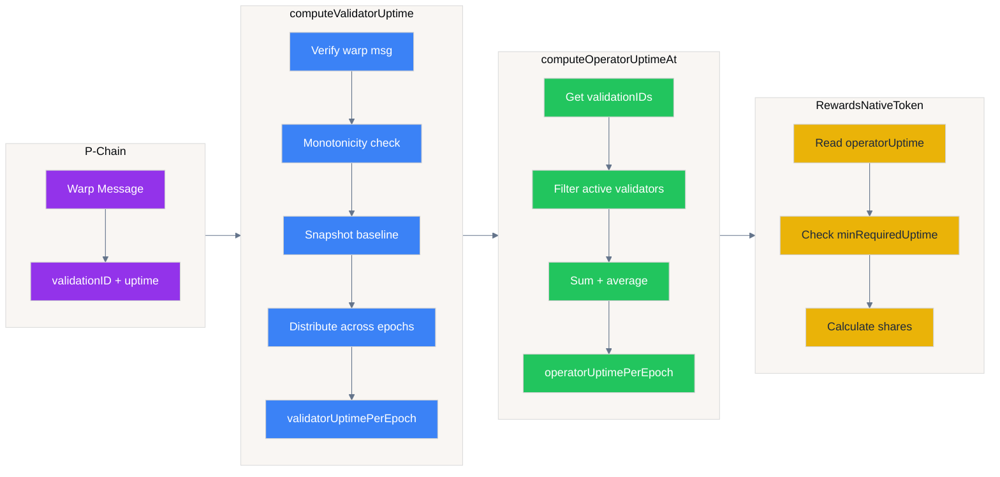
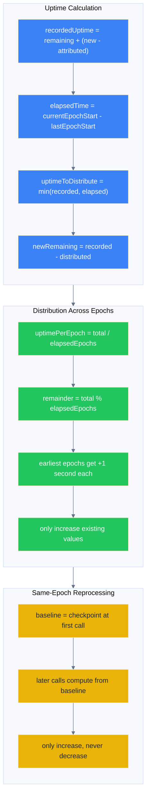

# UptimeTracker

Tracks validator uptime from P-Chain warp messages and aggregates it per operator per epoch for reward distribution.

---

## Overview

The UptimeTracker receives cumulative uptime proofs via Avalanche Warp Messaging and distributes them across epochs. It serves as the uptime source for `RewardsNativeToken`.



**Flow summary:**
1. **P-Chain** → Warp message with `(validationID, cumulative uptime)`
2. **computeValidatorUptime** → Distribute uptime across elapsed epochs per validator
3. **computeOperatorUptimeAt** → Aggregate validator uptimes into operator average
4. **RewardsNativeToken** → Read operator uptime, check threshold, calculate reward shares

**Message format** (`ValidationUptimeMessage`):
```
| validationID : [32]byte | 32 bytes |
|       uptime :   uint64 |  8 bytes |
```

---

## Constructor

```solidity
constructor(address payable middleware_, bytes32 uptimeBlockchainID_)
```

| Parameter | Description |
|-----------|-------------|
| `middleware_` | AvalancheL1Middleware contract address |
| `uptimeBlockchainID_` | L1's blockchain ID (must match warp message sourceChainID) |

**Derived immutables:**
- `epochDuration` from middleware
- `validatorManager` from middleware's BALANCER

---

## Functions

### `computeValidatorUptime(uint32 messageIndex)`

Reads a `ValidationUptimeMessage` from the Warp precompile and distributes uptime across elapsed epochs.

**Flow:**
1. Verify warp message (valid, correct sourceChainID, originSenderAddress == 0)
2. Unpack `(validationID, uptime)` from payload
3. Apply monotonicity guard: reject if `uptime <= validatorHighestUptime[validationID]`
4. Snapshot baseline checkpoint for current epoch (first call only)
5. Calculate `elapsedEpochs` and distribute uptime evenly across them
6. Update checkpoint for next epoch

**Same-epoch reprocessing:**
- Multiple calls within the same epoch are allowed
- Later calls with higher uptime overwrite earlier distributions
- Uses epoch baseline to ensure consistent `elapsedEpochs` calculation

### `computeOperatorUptimeAt(address operator, uint48 epoch)`

Aggregates validator uptimes into operator uptime for a given epoch.

**Flow:**
1. Get all `validationIDs` for operator from middleware
2. Filter validators active during the epoch (by start/end times)
3. Sum their `validatorUptimePerEpoch` values
4. Store average as `operatorUptimePerEpoch`

**Reprocessing rules:**
- Same epoch: can reprocess, updates if computed value is higher
- Different epoch: reverts with `UptimeTracker__OperatorUptimeAlreadySet`

### `getLastUptimeCheckpoint(bytes32 validationID)`

Returns the last recorded checkpoint for a validator.

---

## Storage

| Mapping | Description |
|---------|-------------|
| `validatorLastUptimeCheckpoint` | Checkpoint state per validator (remainingUptime, attributedUptime, timestamp) |
| `validatorUptimePerEpoch` | Distributed uptime per (epoch, validationID) in seconds |
| `isValidatorUptimeSet` | Whether validator uptime is set for (epoch, validationID) |
| `operatorUptimePerEpoch` | Aggregated operator uptime per (epoch, operator) in seconds |
| `isOperatorUptimeSet` | Whether operator uptime is set for (epoch, operator) |
| `validatorHighestUptime` | Monotonicity guard: highest uptime seen per validationID |
| `validatorEpochBaseline` | Snapshot of checkpoint at first call in current epoch |
| `operatorUptimeComputedAtEpochPlusOne` | Epoch sentinel for same-epoch reprocessing |

---

## Checkpoint Model

Each validator has a `LastUptimeCheckpoint`:
```solidity
struct LastUptimeCheckpoint {
    uint256 remainingUptime;    // Excess uptime carried to next epoch
    uint256 attributedUptime;   // Last processed cumulative uptime value
    uint256 timestamp;          // Checkpoint timestamp (epoch start)
}
```



**Distribution:**
- Uptime is split evenly across `elapsedEpochs`
- Remainder seconds distributed one per epoch (earliest first)
- Total distributed is capped by `elapsedTime` (implicit cap at `epochDuration` per epoch)
- Only increases existing values (monotonicity)

---

## Epoch Baseline

On the first call in a new epoch, the current checkpoint is snapshotted as the "baseline". All subsequent calls within the same epoch compute from this baseline.

**Purpose:** Ensures that same-epoch reprocessing with higher uptime correctly recalculates distributions, rather than seeing `elapsedEpochs = 0` because the checkpoint was already advanced.

---

## Monotonicity Guards

### Validator Uptime
```solidity
if (stored > 0 && uptime <= stored) {
    return;  // Reject stale/equal messages
}
```
Prevents replay of old messages. Only strictly higher cumulative uptime values are processed.

### Epoch Distribution
```solidity
if (isValidatorUptimeSet[epoch][validationID]) {
    if (epochUptime <= validatorUptimePerEpoch[epoch][validationID]) {
        continue;  // Only update if new value is higher
    }
}
```
Allows correction within the same epoch while preventing value reduction.

### Operator Uptime
```solidity
if (isOperatorUptimeSet[epoch][operator]) {
    if (operatorUptimeComputedAtEpochPlusOne[epoch][operator] != currentEpochPlusOne) {
        revert;  // Different epoch: write-once
    }
    if (computed <= prev) {
        return;  // Same epoch but not higher: no-op
    }
}
```
Same-epoch reprocessing allowed (increases only). Cross-epoch reprocessing reverts.

---

## Warp Message Verification

Messages must satisfy:
- `valid == true` from `WARP_MESSENGER.getVerifiedWarpMessage()` (BLS signatures verified)
- `sourceChainID == uptimeBlockchainID` (L1's blockchain ID)
- `originSenderAddress == address(0)` (proves off-chain origin, not arbitrary on-chain message)

**Precompile address:** `0x0200000000000000000000000000000000000005`

---

## Events

| Event | Description |
|-------|-------------|
| `ValidatorUptimeComputed(validationID, firstEpoch, uptimeSecondsAdded, numberOfEpochs)` | Emitted when validator uptime is distributed |
| `OperatorUptimeComputed(operator, epoch, uptime)` | Emitted when operator uptime is aggregated |

---

## Errors

| Error | Description |
|-------|-------------|
| `InvalidWarpMessage` | Warp message failed verification |
| `InvalidWarpSourceChainID` | Message from wrong chain |
| `InvalidWarpOriginSenderAddress` | Message has non-zero origin sender |
| `UptimeBeforeStart` | Current epoch is before validator start epoch |
| `UptimeTracker__ValidatorUptimeNotRecorded` | Validator uptime not set for required epoch |
| `UptimeTracker__NoValidators` | Operator has no active validators for epoch |
| `UptimeTracker__OperatorUptimeAlreadySet` | Operator uptime already computed (from different epoch) |

---

## Integration with RewardsNativeToken

`RewardsNativeToken` reads `operatorUptimePerEpoch` during distribution:
```solidity
uint256 uptime = uptimeTracker.operatorUptimePerEpoch(epoch, operator);
if (uptime < minRequiredUptime) {
    operatorShares[epoch][operator] = 0;  // Zero rewards
}
```

Operators must meet `minRequiredUptime` threshold to receive rewards.

