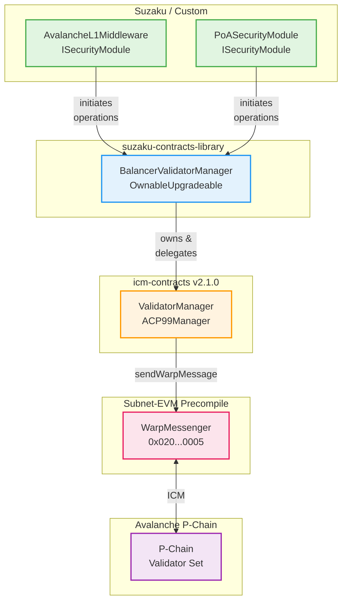
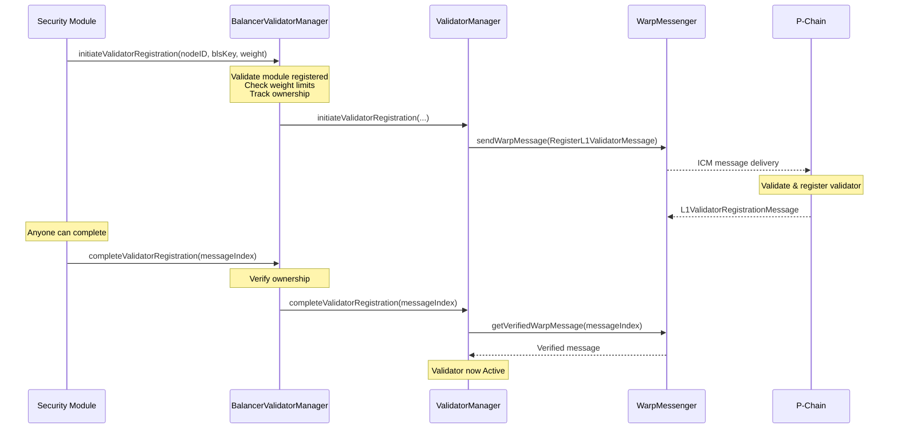
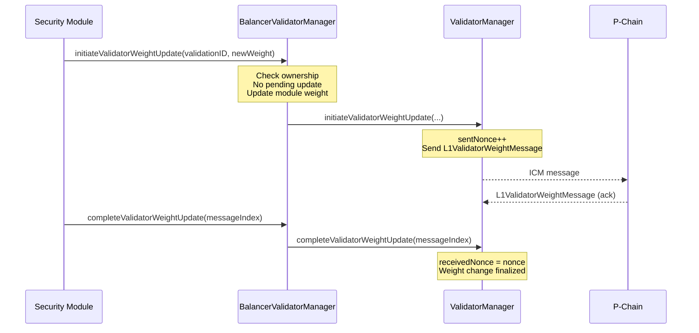
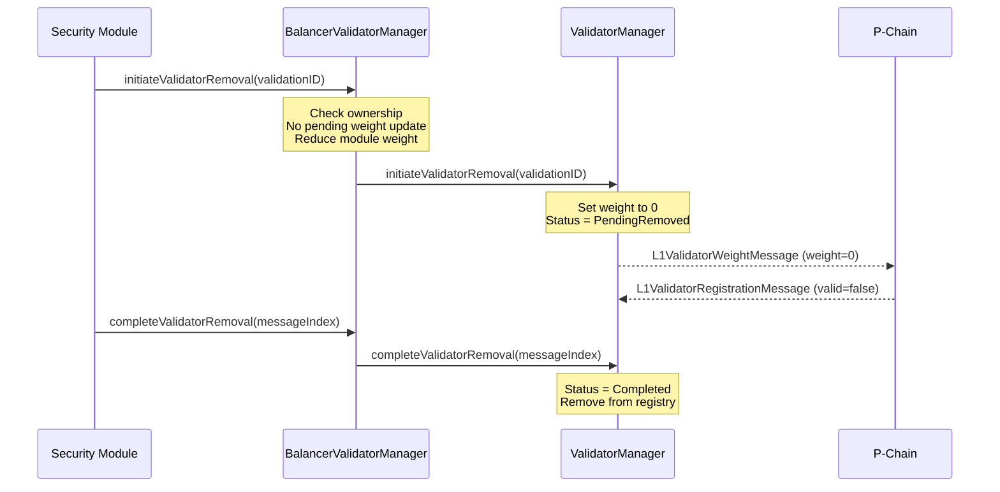

# Balancer Validator Manager

The `BalancerValidatorManager` contract wraps the ICM `ValidatorManager` (v2.1.0) and implements a validator management system that allows multiple security modules to control portions of the validator set. Each security module is allocated a maximum weight they can assign to their validators.

---

## Table of Contents

- [Overview](#overview)
- [Architecture](#architecture)
  - [Contract Hierarchy](#contract-hierarchy)
  - [Security Module Pattern](#security-module-pattern)
  - [Ownership Model](#ownership-model)
- [Key Features](#key-features)
- [Validator Lifecycle](#validator-lifecycle)
  - [Registration Flow](#registration-flow)
  - [Weight Updates](#weight-updates)
  - [Removal Flow](#removal-flow)
- [P-Chain Communication](#p-chain-communication)
  - [Warp Messaging](#warp-messaging)
  - [Async Operations](#async-operations)
  - [Message Types](#message-types)
- [Weight Management](#weight-management)
  - [Security Module Limits](#security-module-limits)
  - [Churn Rate Control](#churn-rate-control)
- [Nonce Tracking](#nonce-tracking)
- [Functions Reference](#functions-reference)
  - [Security Module Management](#security-module-management)
  - [Validator Operations](#validator-operations)
  - [Getters](#getters)
  - [Inherited Functions](#inherited-functions)
- [Migration Support](#migration-support)
- [Security Modules](#security-modules)
  - [PoA Security Module](#poa-security-module)
  - [Custom Security Modules](#custom-security-modules)
- [Error Handling](#error-handling)
- [Events](#events)
- [Security Considerations](#security-considerations)
- [Integration Examples](#integration-examples)

---

## Overview

The BalancerValidatorManager enables multiple independent security modules to share control of an Avalanche L1's validator set while maintaining strict weight allocation limits. It acts as a wrapper around the core ICM `ValidatorManager`, adding:

- **Multi-tenant validator management** — Multiple security modules operate independently
- **Weight allocation enforcement** — Each module has a maximum weight budget
- **Validator ownership tracking** — Each validator is attributed to its managing module
- **Churn visibility** — Exposes underlying churn rate parameters

This design enables scenarios like:
- Suzaku middleware managing restaked validators alongside PoA validators
- Multiple staking protocols sharing one L1's validator set
- Gradual decentralization from PoA to stake-weighted validation

---

## Architecture

### Contract Hierarchy



### Security Module Pattern

Security modules must:
1. Implement `ISecurityModule` interface
2. Support ERC-165 interface detection (`supportsInterface`)
3. Be registered by the BalancerValidatorManager owner with a weight allocation

```solidity
interface ISecurityModule is IERC165 {
    function completeValidatorRegistration(uint32 messageIndex) external returns (bytes32);
    function completeValidatorRemoval(uint32 messageIndex) external returns (bytes32);
    function completeValidatorWeightUpdate(uint32 messageIndex) external returns (bytes32, uint64);
}
```

### Ownership Model

| Contract | Owner | Responsibilities |
|----------|-------|------------------|
| BalancerValidatorManager | Protocol admin/DAO | Register security modules, set weight limits |
| ValidatorManager | BalancerValidatorManager | All validator operations delegated through Balancer |
| Security Modules | Module-specific | Initiate/complete validator operations within weight budget |

---

## Key Features

| Feature | Description |
|---------|-------------|
| **Multi-tenant** | Multiple security modules share the validator set |
| **Weight allocation** | Each module has configurable max weight |
| **Validator ownership** | Validators are attributed to their registering module |
| **Churn rate limiting** | Inherited from ValidatorManager |
| **Async P-Chain ops** | Two-phase commit for all validator changes |
| **Pending weight tracking** | Prevents concurrent weight updates per validator |
| **Migration support** | Wrap existing ValidatorManager with active validators |

---

## Validator Lifecycle

### Registration Flow



**Key points:**
- `initiateValidatorRegistration` is security-module restricted
- Module's weight increases immediately on initiation
- `completeValidatorRegistration` is also module-restricted (caller must be the registering module)
- Registration has a 1-day expiry — if not completed, validator can be removed

### Weight Updates



**Restrictions:**
- Cannot initiate weight update while one is pending (`sentNonce > receivedNonce`)
- Cannot set weight to 0 (use `initiateValidatorRemoval` instead)
- Weight update consumes churn budget

### Removal Flow



---

## P-Chain Communication

### Warp Messaging

All communication with the P-Chain uses Avalanche's **Warp Messaging** (ICM — Interchain Messaging):

```solidity
IWarpMessenger constant WARP_MESSENGER = IWarpMessenger(0x0200000000000000000000000000000000000005);
```

**Sending messages:**
```solidity
bytes32 messageID = WARP_MESSENGER.sendWarpMessage(payload);
```

**Receiving messages:**
```solidity
(WarpMessage memory msg, bool valid) = WARP_MESSENGER.getVerifiedWarpMessage(messageIndex);
// Verification checks:
// - valid == true (BLS signatures verified)
// - sourceChainID == P_CHAIN_BLOCKCHAIN_ID (bytes32(0))
// - originSenderAddress == address(0) (off-chain origin)
```

### Async Operations

All validator operations are **two-phase commits**:

| Phase | Initiate | Complete |
|-------|----------|----------|
| Registration | Sends `RegisterL1ValidatorMessage` | Receives `L1ValidatorRegistrationMessage` (valid=true) |
| Removal | Sends `L1ValidatorWeightMessage` (weight=0) | Receives `L1ValidatorRegistrationMessage` (valid=false) |
| Weight Update | Sends `L1ValidatorWeightMessage` | Receives `L1ValidatorWeightMessage` (ack) |

**Why async?**
- P-Chain must validate and sequence changes
- Prevents conflicting validator set states
- Enables BLS signature aggregation for consensus

### Message Types

| Message | Direction | Purpose |
|---------|-----------|---------|
| `SubnetToL1ConversionMessage` | P-Chain → L1 | Initial validator set (one-time) |
| `RegisterL1ValidatorMessage` | L1 → P-Chain | Request new validator registration |
| `L1ValidatorRegistrationMessage` | P-Chain → L1 | Registration result (valid=true/false) |
| `L1ValidatorWeightMessage` | Bidirectional | Weight change request/acknowledgment |
| `ValidationUptimeMessage` | L1-signed | Validator uptime proof (for rewards) |

---

## Weight Management

### Security Module Limits

Each security module has:
- **Current weight**: Sum of all validator weights attributed to this module
- **Maximum weight**: Upper bound set by BalancerValidatorManager owner

```solidity
// Get module weights
(uint64 weight, uint64 maxWeight) = balancer.getSecurityModuleWeights(moduleAddress);
```

**Enforcement:**
- Registration/weight increase reverts if it would exceed `maxWeight`
- Cannot reduce `maxWeight` below current weight
- Cannot remove module with non-zero weight or assigned validators

### Churn Rate Control

Inherited from `ValidatorManager`:

| Parameter | Description | Constraint |
|-----------|-------------|------------|
| `churnPeriodSeconds` | Duration of churn tracking window | ≤ 1 day |
| `maximumChurnPercentage` | Max % of total weight added/removed per period | 1-20% |

```solidity
// Access via BalancerValidatorManager
uint64 churnPeriod = balancer.getChurnPeriodSeconds();
uint64 maxChurn = balancer.getMaximumChurnPercentage();
ValidatorChurnPeriod memory current = balancer.getCurrentChurnPeriod();
```

---

## Nonce Tracking

Each validator tracks two nonces for weight message ordering:

| Field | Description |
|-------|-------------|
| `sentNonce` | Incremented on each weight change initiation |
| `receivedNonce` | Updated to match acknowledged nonce from P-Chain |

**Pending weight update detection:**
```solidity
bool pending = validator.sentNonce > validator.receivedNonce;
// Also exposed via:
bool pending = balancer.isValidatorPendingWeightUpdate(validationID);
```

**Resending stale messages:**
```solidity
// Permissionless — resend latest weight message when pending
balancer.resendValidatorWeightUpdate(validationID);
```

---

## Functions Reference

### Security Module Management

| Function | Access | Description |
|----------|--------|-------------|
| `setUpSecurityModule(module, maxWeight)` | Owner | Register/update/remove (maxWeight=0) a module |
| `getSecurityModules()` | View | List all registered modules |
| `getSecurityModuleWeights(module)` | View | Get current and max weight for a module |
| `getValidatorSecurityModule(validationID)` | View | Get owning module for a validator |

### Validator Operations

| Function | Access | Description |
|----------|--------|-------------|
| `initiateValidatorRegistration(...)` | Security Module | Start validator registration |
| `completeValidatorRegistration(msgIdx)` | Security Module | Complete registration (same module) |
| `initiateValidatorRemoval(valID)` | Security Module | Start validator removal |
| `completeValidatorRemoval(msgIdx)` | Security Module | Complete removal (same module) |
| `initiateValidatorWeightUpdate(valID, weight)` | Security Module | Start weight update |
| `completeValidatorWeightUpdate(msgIdx)` | Security Module | Complete weight update (same module) |
| `resendValidatorWeightUpdate(valID)` | Permissionless | Resend pending weight message |
| `resendRegisterValidatorMessage(valID)` | Permissionless | Resend pending registration |
| `resendValidatorRemovalMessage(valID)` | Permissionless | Resend pending removal |

### Getters

| Function | Description |
|----------|-------------|
| `isValidatorPendingWeightUpdate(valID)` | Check if validator has pending weight update |
| `getChurnPeriodSeconds()` | Get churn period duration |
| `getMaximumChurnPercentage()` | Get max churn percentage |
| `getCurrentChurnPeriod()` | Get current churn tracking state |
| `getValidator(valID)` | Get validator details (status, weight, nonces) |
| `getNodeValidationID(nodeID)` | Get validationID for a nodeID |
| `l1TotalWeight()` | Get total weight of all validators |
| `subnetID()` | Get the L1's subnet ID |

### Inherited Functions

| Function | Description |
|----------|-------------|
| `initializeValidatorSet(conversionData, msgIdx)` | Initialize from L1 conversion (one-time) |
| `migrateFromV1(validationID, receivedNonce)` | Migrate validator from V1 storage format |
| `transferValidatorManagerOwnership(newOwner)` | Transfer ValidatorManager ownership (owner only) |

---

## Migration Support

When wrapping an existing `ValidatorManager` that already has active validators:

```solidity
BalancerValidatorManagerSettings memory settings = BalancerValidatorManagerSettings({
    baseSettings: validatorManagerSettings,
    initialOwner: ownerAddress,
    initialSecurityModule: existingModuleAddress,  // Required if VM has weight
    initialSecurityModuleMaxWeight: 100000,        // Must be >= current total weight
    migratedValidators: nodeIDsArray               // All existing validator nodeIDs
});
```

**Requirements:**
- `initialSecurityModule` required if `ValidatorManager.l1TotalWeight() > 0`
- `migratedValidators` must list all active validator nodeIDs
- Total weight of migrated validators must match `l1TotalWeight()` exactly

---

## Security Modules

### PoA Security Module

The `PoASecurityModule` provides Proof-of-Authority style validator management:

```solidity
contract PoASecurityModule is Ownable, ERC165, ISecurityModule {
    IBalancerValidatorManager public immutable balancerValidatorManager;
    
    // Owner-restricted initiation
    function initiateValidatorRegistration(...) external onlyOwner returns (bytes32);
    function initiateValidatorRemoval(bytes32 validationID) external onlyOwner;
    function initiateValidatorWeightUpdate(bytes32 validationID, uint64 newWeight) external onlyOwner;
    
    // Permissionless completion (anyone can finalize after P-Chain ack)
    function completeValidatorRegistration(uint32 messageIndex) external returns (bytes32);
    function completeValidatorRemoval(uint32 messageIndex) external returns (bytes32);
    function completeValidatorWeightUpdate(uint32 messageIndex) external returns (bytes32, uint64);
}
```

**Design rationale:**
- **Owner-controlled initiation**: Only the PoA owner can add/remove validators
- **Permissionless completion**: Anyone can finalize operations once P-Chain acknowledges, improving liveness

### Custom Security Modules

To create a custom security module:

1. Implement `ISecurityModule` interface
2. Implement ERC-165 `supportsInterface`
3. Call `balancerValidatorManager.initiate*` for operations
4. Implement access control as needed

Example: Suzaku's `AvalancheL1Middleware` implements `ISecurityModule` to manage validators based on restaked collateral.

---

## Error Handling

| Error | Cause |
|-------|-------|
| `BalancerValidatorManager__SecurityModuleNotRegistered` | Module not registered or ERC-165 check failed |
| `BalancerValidatorManager__SecurityModuleMaxWeightExceeded` | Operation would exceed module's max weight |
| `BalancerValidatorManager__ValidatorNotBelongingToSecurityModule` | Validator not owned by calling module |
| `BalancerValidatorManager__PendingWeightUpdate` | Cannot remove/update while weight update pending |
| `BalancerValidatorManager__NoPendingWeightUpdate` | No pending update to resend/complete |
| `BalancerValidatorManager__NewWeightIsZero` | Use `initiateValidatorRemoval` for removal |
| `BalancerValidatorManager__CannotRemoveModuleWithWeight` | Module has non-zero weight |
| `BalancerValidatorManager__CannotRemoveModuleWithAssignedValidators` | Module has validators (even if weight=0) |
| `BalancerValidatorManager__InvalidWarpMessage` | Warp message verification failed |
| `BalancerValidatorManager__VMValidatorSetNotInitialized` | ValidatorManager not initialized |
| `InvalidValidatorStatus` | Operation not valid for current validator status |

---

## Events

| Event | Description |
|-------|-------------|
| `SetUpSecurityModule(module, maxWeight)` | Module registered/updated/removed |
| `SecurityModuleWeightUpdated(module, oldWeight, newWeight, maxWeight)` | Module's current weight changed |

Plus all events inherited from `ValidatorManager` (see ICM contracts).

---

## Security Considerations

1. **Weight accounting**: Module weight is updated optimistically on initiation, ensuring the module cannot over-allocate even if completion is delayed.

2. **Pending state guards**: Cannot initiate removal while weight update is pending (would cause accounting issues).

3. **Ownership verification**: Completion functions verify the caller is the same security module that initiated the operation.

4. **Permissionless resends**: `resendValidatorWeightUpdate`, `resendRegisterValidatorMessage`, and `resendValidatorRemovalMessage` are permissionless to prevent stuck states if a message is lost.

5. **ERC-165 verification**: Security modules must support ERC-165 interface detection to prevent registering incompatible contracts.

6. **Validator count tracking**: Modules track validator count separately from weight to prevent removal while any validators (even zero-weight pending removal) are assigned.

---

## Integration Examples

### Registering a PoA Module

```solidity
// Deploy PoA module
PoASecurityModule poa = new PoASecurityModule(address(balancer), admin);

// Register with Balancer (owner call)
balancer.setUpSecurityModule(address(poa), 10000); // max 10000 weight

// Add a validator (PoA owner call)
bytes32 validationID = poa.initiateValidatorRegistration(
    nodeID,
    blsPublicKey,
    PChainOwner({threshold: 1, addresses: [admin]}),
    PChainOwner({threshold: 1, addresses: [admin]}),
    1000 // weight
);

// After P-Chain acknowledgment (anyone can call)
poa.completeValidatorRegistration(messageIndex);
```

### Checking Module Status

```solidity
// List all modules
address[] memory modules = balancer.getSecurityModules();

// Check a module's allocation
(uint64 current, uint64 max) = balancer.getSecurityModuleWeights(moduleAddr);
uint64 available = max - current;

// Check total L1 weight
uint64 total = balancer.l1TotalWeight();
```

---

## Related Documentation

- [Protocol Overview](./1-overview.md) — Suzaku Core architecture and components
- [ICM & P-Chain Integration](./10-icm-pchain-integration.md) — Warp messaging, validator lifecycle, P-Chain communication
- [Middleware Documentation](./4-middleware.md) — AvalancheL1Middleware as a security module
- [Uptime Tracker](./6-uptimeTracker.md) — Validator uptime tracking and distribution
- [Rewards Documentation](./5-rewardsNativeToken.md) — Epoch-based rewards distribution
- [ICM Contracts](https://github.com/ava-labs/icm-contracts) — Avalanche's Interchain Messaging contracts
- [ACP-77](https://github.com/avalanche-foundation/ACPs/tree/main/ACPs/77-reinventing-subnets) — L1 specification
- [ACP-99](https://github.com/avalanche-foundation/ACPs/tree/main/ACPs/99-validatorsetmanager-contract) — ValidatorSetManager contract specification
