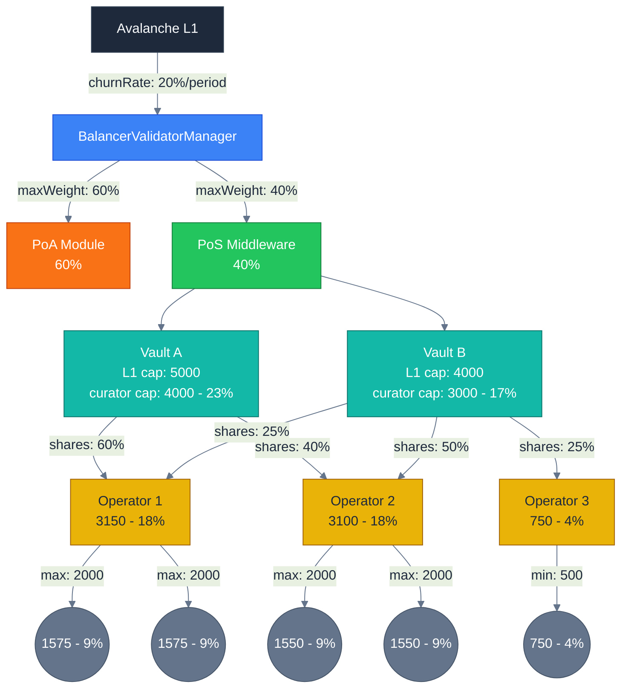
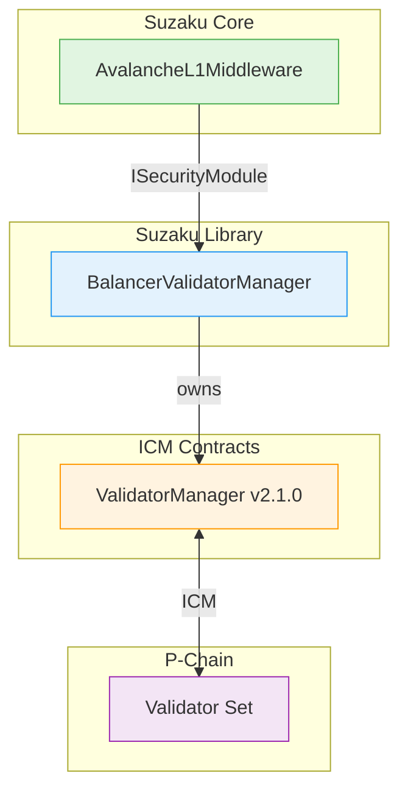

# Suzaku Protocol Overview

## Introduction

Suzaku enables Avalanche L1 builders to decentralize their networks by orchestrating operators, curators, and stakers. It combines native token staking with restaking of collateral assets (stablecoins, LSTs), forked from [Symbiotic Core](https://github.com/symbioticfi/core) and adapted for Avalanche's ICM and validator management.

### Stake Flow

Stake flows from L1 through security modules, vaults, operators, to validators—each layer applying constraints:

### Participants

| Role | Responsibility |
|------|----------------|
| **L1 Builders** | Define staking rules, configure collateral classes |
| **Stakers** | Deposit collateral into vaults to earn rewards |
| **Operators** | Run validators, must meet stake requirements |
| **Curators** | Deploy vaults, select operators, manage delegation |

---

## Architecture

### Core Components

| Component | Purpose |
|-----------|---------|
| **L1Registry** | Registers L1s with middleware and validator manager |
| **OperatorRegistry** | Tracks operators and metadata |
| **VaultFactory** | Deploys/upgrades vaults via ERC1967 proxies |
| **VaultTokenized** | ERC4626-style vault with epoch-based withdrawals (EPOCH+2 delay) |
| **VaultHelper** | Batch operations for vaults deposits/withdrawals |
| **BaseDelegator** | Tracks max stake per (L1, collateralClass) |
| **L1RestakeDelegator** | Shares-based delegation with checkpointing |
| **LSTWrapper** | ERC-4626 auto-compounding wrapper for vault shares |

### Opt-In Services

| Service | Purpose |
|---------|---------|
| **OperatorL1OptInService** | Operators opt into L1s to validate |
| **OperatorVaultOptInService** | Operators opt into vaults for collateral |

### Middleware Layer

| Component | Purpose |
|-----------|---------|
| **AvalancheL1Middleware** | Core L1 orchestration: operator lifecycle, node weights, epoch transitions |
| **MiddlewareVaultManager** | Registers vaults with stake limits per vault/collateral-class |
| **CollateralClassRegistry** | Groups tokens by class with min/max stake requirements |

**Collateral Classes:**
- **Primary (ID 1)**: L1 native token — required, has min/max stake, determines validator weight registered in the Validator Manager.
- **Secondary (ID 2+)**: Additional assets (stablecoins, LSTs) — optional, min stake only, for dual-staking

### Rewards

| Component | Purpose |
|-----------|---------|
| **RewardsNativeToken** | Epoch-based distribution by collateral class, uptime, stake routing |
| **UptimeTracker** | Tracks validator uptime per epoch |

### External Integration

---

## Protocol Flow

### 1. L1 Onboarding
1. Register L1 in `L1Registry` with middleware/validator manager
2. Configure collateral classes with min/max stake
3. Register vaults via `MiddlewareVaultManager` with stake limits per vault/collateral-class
4. Register operators via middleware (`registerOperator`)

### 2. Operator & Curator Setup
1. Operators register in `OperatorRegistry`
2. Operators opt into L1s via `OperatorL1OptInService`
3. Operators opt into vaults via `OperatorVaultOptInService`
4. Curators deploy vaults → set delegation shares for operators

### 3. Staking & Validation
1. Stakers deposit into vaults (or LST wrappers for auto-compound)
2. Curators assign operator shares within L1 limits (`setOperatorL1Shares`)
3. Operators add validator nodes via middleware (`addNode`)
4. Middleware calculates weights → BalancerValidatorManager → P-Chain
5. Anyone completes pending operations (`completeValidatorRegistration`)

### 4. Epoch Progression
1. Epoch transition updates node stake caches
2. Pending updates resolved (registrations/removals/weight changes)
3. UptimeTracker records validator performance

### 5. Rewards
1. Distributor funds epochs (protocol fee upfront)
2. Distribution by: collateral weights × uptime × stake routing
3. Split: operator fee → curator fee → stakers
4. Claim up to 64 epochs per call

---

## Key Features

| Feature | Description |
|---------|-------------|
| **Multi-Collateral** | Native tokens, stablecoins, LSTs |
| **Flexible Security** | PoS, restaking, dual staking models |
| **LST Wrappers** | ERC-4626 auto-compounding wrappers |
| **Epoch Rewards** | Fair distribution by uptime/stake/class |
| **No Principal Slash** | Only rewards can be lost, not principal |
| **Security Modules** | Modular validator management (PoA, PoS) |

---

## Security

- **No principal slashing** — only rewards at risk
- **EPOCH+2 withdrawal delay** — stake stability during validation
- **Permissionless completion** — anyone can complete pending operations
- **Decimal validation** — collateral class assets must match decimals
- **Role-based access** — granular permissions

---

## Documentation

| Doc | Contents |
|-----|----------|
| [1. Overview](./overview.md) | This document — architecture, flow, components |
| [2. Stake Limits](./stake-limits.md) | Weight limiting factors, capacity subdivision |
| [3. Vault](./vault.md) | Vault mechanics, epoch withdrawals |
| [4. Middleware](./middleware.md) | Operator lifecycle, epoch system |
| [5. RewardsNativeToken](./rewardsNativeToken.md) | Distribution mechanics, share calculations |
| [6. UptimeTracker](./uptimeTracker.md) | Validator uptime tracking |
| [7. LST Wrapper](./lst-wrapper.md) | Auto-compounding wrapper mechanics |
| [8. BalancerValidatorManager](../lib/suzaku-contracts-library/src/contracts/ValidatorManager/README.md) | Security module integration |
