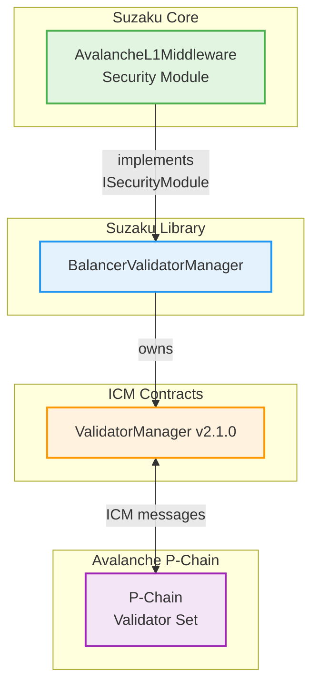

# Suzaku Protocol Overview

## Table of Contents

- [Introduction](#introduction)
- [Protocol Participants](#protocol-participants)
- [Key Features](#key-features)
- [Architecture & Components](#architecture--components)
  - [Core Components](#core-components)
  - [Suzaku Contracts Library Integration](#suzaku-contracts-library-integration)
- [Protocol Flow](#protocol-flow)
- [Component Details](#component-details)
- [Security Considerations](#security-considerations)
- [Additional Documentation](#additional-documentation)

## Introduction

Suzaku enables Avalanche L1 builders to decentralize their networks by orchestrating relationships between operators, curators (delegators), and stakers. The protocol combines native token staking with restaking of high‑quality collateral assets (e.g. stablecoins, liquid staking tokens), allowing L1s to adopt flexible security models.

**Suzaku Core is a fork of [Symbiotic Core](https://github.com/symbioticfi/core), adapted for Avalanche L1 validation.** While maintaining Symbiotic's delegation/vault patterns, Suzaku has been reworked to integrate Avalanche's ICM (Interchain Messaging) and validator management infrastructure, shifting from generic network security to L1‑centric validation orchestration.

## Protocol Participants

- **L1 Builders**: Define staking and slashing rules for their Avalanche L1s
- **Stakers**: Deposit collateral to secure networks and earn rewards
- **Operators**: Run validation infrastructure, must meet staking requirements
- **Curators**: Select operators and L1s, manage stake delegation for depositors

## Key Features

- **Multi-Collateral Support**: L1s can accept multiple collateral classes (native tokens, stablecoins, liquid staking tokens)
- **Flexible Security Models**:
  - **Proof of Stake (PoS)**: Native L1 token staking
  - **Liquid Staking & Restaking**: Enable liquid staking tokens for additional yield opportunities
  - **Dual Staking Model**: Require both native tokens and whitelisted collateral, mitigating token volatility risks
- **Epoch-Based Rewards**: Fair reward distribution based on uptime, stake, and collateral class weights
- **Security Modules**: Modular architecture supporting multiple validator management strategies via the BalancerValidatorManager
- **Role-Based Access Control**: Granular permissions for protocol administration
- **No Slashing on Principal**: Currently, only validation rewards can be lost for poor uptime (principal remains safe)

## Architecture & Components

### Core Components

#### Registries
- **L1Registry**: Registers Avalanche L1s with their middleware and validator manager references
- **OperatorRegistry**: Tracks registered operators and their metadata
- **VaultFactory**: Deploys and upgrades tokenized vaults via ERC1967 proxies

#### Vaults & Delegation
- **VaultTokenized**: Upgradeable "ERC4626‑style" vaults that support epoch‑based withdrawals and checkpointed balances
  - Withdrawals become claimable at `EPOCH+2` max (i.e. two epochs delay) for each deposit epoch
  - Role-based access control governs deposits, vault limits, and whitelisting
- **BaseDelegator**: Tracks maximum stake allocation per `(L1, collateralClass)` pair
- **L1RestakeDelegator**: Implements a shares‑based delegation model with historical checkpointing

> **📖 For detailed vault mechanics, operations, and integration patterns, see [Vault Documentation](./vault.md)**

#### Opt-In Services
- **OperatorL1OptInService**: Operators explicitly opt into L1s they will validate
- **OperatorVaultOptInService**: Operators opt into vaults they accept collateral from

#### Middleware Layer (L1-Owned)
- **AvalancheL1Middleware**: Core orchestration contract per L1
  - Inherits from **CollateralClassRegistry** (formerly AssetClassRegistry) to manage multiple collateral types with min/max stake requirements
  - Controls operator and node lifecycle (registration, removal, weight updates)
  - Implements **ISecurityModule** interface for integration with BalancerValidatorManager
  - Manages node weight calculations and epoch transitions
  - Enforces stake locking during pending updates to prevent rewards manipulation
  - **Permissionless completion functions** (`completeValidatorRegistration`, `completeValidatorRemoval`, `completeValidatorWeightUpdate`) improve system liveness

> **📖 For detailed middleware architecture, epoch system, and operator lifecycle, see [Middleware Documentation](./middleware.md)**

#### Middleware Support (L1-Owned)
- **MiddlewareVaultManager**: Registers vaults to L1s with stake limits per vault/collateral-class pair
- **CollateralClassRegistry** (formerly AssetClassRegistry): Groups ERC20 tokens by class with staking requirements
  - **Decimal validation**: All assets in a collateral class must have matching decimals
  - Role-based administration via `COLLATERAL_CLASS_MANAGER_ROLE`

#### Rewards System
- **Rewards**: Epoch-based rewards distribution
  - **Funding**: Set rewards per epoch with protocol fee taken upfront
  - **Distribution**: Compute shares by collateral class, operator uptime, and vault stake routing
  - **Claims**: Process up to 64 epochs per call to prevent out-of-gas conditions
  - **Sweep**: Recover undistributed rewards after grace period
  - Time windows ensure proper funding and settlement
- **UptimeTracker**: Tracks validator uptime across epochs
  - Validates against epochs before validator start
  - Sources data from middleware's balancer for validator manager access

> **📖 For complete rewards mechanics, share calculations, and time windows, see [Rewards Documentation](./rewards.md)**

### Suzaku Contracts Library Integration

The protocol integrates tightly with [suzaku-contracts-library](https://github.com/suzaku-network/suzaku-contracts-library), notably:

#### BalancerValidatorManager
Located at `lib/suzaku-contracts-library/src/contracts/ValidatorManager/`, the **BalancerValidatorManager** wraps the ICM ValidatorManager (v2.1.0) and enables multiple security modules to manage portions of the validator set.

**Key Features:**
- Multiple security modules operate independently with weight limits
- Each security module has a maximum weight allocation
- Tracks and enforces weight limits per module
- Supports wrapping existing ValidatorManagers with migration support
- Provides enhanced getters for validator state

**Architecture:**

The middleware acts as a security module, initiating validator operations through the balancer, which enforces weight limits and coordinates with the underlying ICM ValidatorManager for P-Chain interactions.

**Security Modules:**
- **PoASecurityModule**: Proof of Authority implementation with owner-controlled validator management
- **AvalancheL1Middleware**: Restaking-based security module (this protocol)

> **📖 For detailed BalancerValidatorManager architecture and security module integration, see [BalancerValidatorManager Documentation](../lib/suzaku-contracts-library/src/contracts/ValidatorManager/README.md)**

## Protocol Flow

### 1. L1 Onboarding
1. L1 owner registers the L1 in `L1Registry` with middleware and validator manager addresses
2. L1 owner registers vaults through `MiddlewareVaultManager`, setting stake limits per vault/collateral-class
3. L1 owner configures collateral classes (primary + secondary) with min/max stake requirements

### 2. Operator & Curator Setup
1. Operators register in `OperatorRegistry`
2. Operators opt into L1s via `OperatorL1OptInService`
3. Operators opt into vaults via `OperatorVaultOptInService`
4. Curators deploy vaults and set delegation shares for operators

### 3. Staking & Validation
1. Stakers deposit collateral into vaults
2. Vaults track active stake with epoch-based withdrawals (`EPOCH+2` delay)
3. Delegators assign operator shares within L1 limits
4. Operators add/remove/update validator nodes through middleware
5. Middleware calculates node weights and coordinates with BalancerValidatorManager
6. BalancerValidatorManager enforces weight limits and communicates with ICM ValidatorManager

### 4. Epoch Progression
1. Epoch transitions trigger node stake cache updates
2. Pending node updates are resolved (registrations, removals, weight changes)
3. Locked stake from mid-epoch changes is released
4. `UptimeTracker` records validator performance

> **📖 For detailed epoch system mechanics and time windows, see [Middleware Documentation](./middleware.md#epoch-system)**

### 5. Rewards Distribution
1. Distributor funds epochs with reward tokens (protocol fee taken upfront)
2. Distribution calculates shares based on:
   - Collateral class weights
   - Operator uptime (must meet minimum threshold)
   - Vault stake routing to each operator
3. Shares split between operators (fee), curators (fee), and stakers (remaining)
4. Participants claim rewards for completed epochs (max 64 epochs per call)
5. Undistributed rewards (rounding leftovers) can be swept after grace period

> **📖 For detailed rewards mechanics, share calculations, and time windows, see [Rewards Documentation](./rewards.md)**

## Component Details

### VaultTokenized (Owner: Curator)
- **Purpose**: An upgradable tokenized vault (ERC4626-like) that manages deposits, withdrawals, and shares staking
- **Epoch-Based Withdrawals**: Redeemed amounts become claimable in `EPOCH+2`, ensuring stable stake across each epoch
- **Checkpointing**: Tracks historical balances (active stake/shares) for record-keeping
- **Deployed Behind an ERC1967 Proxy**: The vault factory (`VaultFactory`) deploys each vault as a `MigratableEntityProxy`
- **Initialization**: The vault's `initialize()` sets up roles, collateral, deposit limits, and admin addresses
- **Upgrades**:
  1. **Factory as Proxy Admin**: Only the factory can invoke `upgradeToAndCall(...)` on the proxy
  2. **Versioned Migrations**: Internally, the vault uses `_migrateInternal(...)` + `reinitializer(newVersion)` to handle logic changes
  3. **`migrate(newVersion, data)`** is called on the vault after pointing the proxy to a new implementation
- **Core Roles & Access Control**:
  - **DEFAULT_ADMIN_ROLE**: Overall admin of the vault
  - **DEPOSIT_WHITELIST_SET_ROLE**: Enable/disable deposit whitelist requirement
  - **DEPOSITOR_WHITELIST_ROLE**: Whitelist specific addresses for deposits
  - **IS_DEPOSIT_LIMIT_SET_ROLE**: Enable/disable the deposit limit

> **📖 For complete vault implementation details and usage examples, see [Vault Documentation](./vault.md)**

### Delegators (Owner: Curator)

#### BaseDelegator
- Tracks maximum stake an entity can allocate to each `(L1, collateralClass)` pair
- Uses a vault reference to ensure operators' stake does not exceed available active stake
- **Key Functions**:
  - `stake(l1, collateralClass, operator)`: Returns the operator's staked amount
  - `stakeAt(l1, collateralClass, operator, timestamp, hints)`: Historical version of `stake`
  - `setMaxL1Limit(l1, collateralClass, amount)`: Sets the maximum limit for a given pair
- **Opt-In Checks**: If an operator is not opted into both the vault and L1, staked amount is considered 0

#### L1RestakeDelegator
- Allocates vault stake among multiple L1s/operators using a **shares** model
- Staked amount = `(operatorShares / totalShares) * min(vault.activeStake, l1Limit)`
- **Shares-Based Model**:
  - `operatorL1Shares[l1][collateralClass][operator]`: Operator's shares for specific L1/collateralClass
  - `totalOperatorL1Shares[l1][collateralClass]`: Total shares across all operators
- **Setting L1 Limits**: Must not exceed `maxL1Limit[l1][collateralClass]` from BaseDelegator
- **Checkpoints**: Each variable uses checkpointing for historical lookups

### AvalancheL1Middleware (Owner: L1)

Ties everything together for each L1:
- Registers operators, controls node lifecycle, coordinates with ValidatorManager
- Inherits from `CollateralClassRegistry` to handle multiple collateral classes
- **Node and Stake Management**:
  1. **Epoch Start**: Operators have node weights set from the previous epoch
  2. **Operators Make Changes** (optional): Add/remove nodes or update weights; mid-epoch changes are queued
  3. **Final Update Window**: Operators may call `forceUpdateNodes(...)` to align weights with available stake
  4. **Epoch Transitions**: Finalize node statuses and resolve pending updates

> **📖 For comprehensive middleware details including roles, functions, and implementation patterns, see [Middleware Documentation](./middleware.md)**

### Weight Factor Considerations
When adding a new security module:
- **Max Weight Alignment**: Balance new and existing modules' `maxWeight` values to avoid churn limit violations
- **Stake-to-Weight Scale Factor**: Choose a factor that matches your min/max stake requirements
- **Combined Churn Limit**: Ensure modules have similar or carefully balanced caps to avoid epoch reverts

## Security Considerations

- **No Principal Slashing**: Currently, the protocol does not slash staking principal—only validation rewards can be lost
- **Epoch-Based Security**: Two-epoch withdrawal delay ensures stake stability during validation periods
- **Permissionless Functions**: Critical operations can be completed by anyone to improve liveness
- **Decimal Validation**: All assets in a collateral class must have matching decimals to prevent calculation errors
- **Role-Based Access**: Granular permissions prevent unauthorized modifications

## Additional Documentation

- [Vault Documentation](./vault.md): Comprehensive vault mechanics, epoch-based withdrawals, and integration patterns
- [Middleware Documentation](./middleware.md): Detailed middleware architecture, validator management, and epoch system
- [Rewards Documentation](./rewards.md): Complete rewards system including distribution mechanics and share calculations
- [BalancerValidatorManager](../lib/suzaku-contracts-library/src/contracts/ValidatorManager/README.md): Security module architecture and integration details
- [Post-Audit Updates](../post-audit-updates.md): Changes from audit baseline to current implementation
